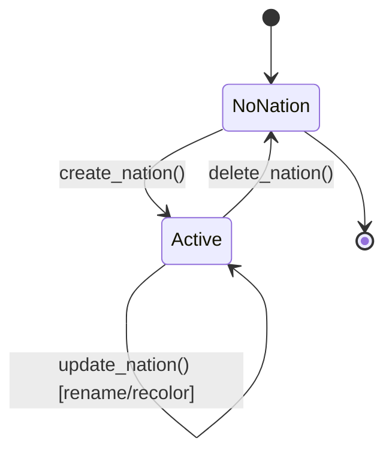
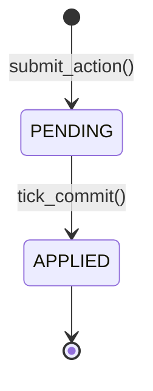
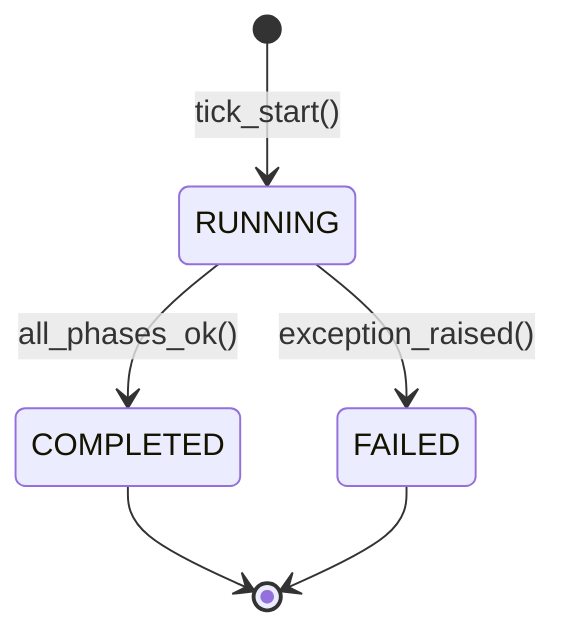

# 02_SYSTEM_SPECS / 00_core

## ЧАСТЬ 1: ДОМЕННАЯ МОДЕЛЬ

> Соответствие русской терминологии Bible и кодовых имён сущностей:
> «Государство» ⇔ `Nation` (не `State` — во избежание конфликта с термином FSM-состояния).

### `players`

| Поле         | Тип         | Ограничения               |
| ------------ | ----------- | ------------------------- |
| `id`         | UUID        | PK, default `uuid4()`     |
| `vk_user_id` | BIGINT      | UNIQUE, NOT NULL          |
| `created_at` | TIMESTAMPTZ | NOT NULL, default `now()` |

### `nations`

| Поле              | Тип                             | Ограничения                             |
| ----------------- | ------------------------------- | --------------------------------------- |
| `id`              | UUID                            | PK, default `uuid4()`                   |
| `owner_player_id` | UUID                            | FK → `players.id`, **UNIQUE**, NOT NULL |
| `name`            | VARCHAR(nation_name_max_length) | UNIQUE, NOT NULL                        |
| `color_hex`       | CHAR(7)                         | UNIQUE, NOT NULL, формат `#RRGGBB`      |
| `created_at`      | TIMESTAMPTZ                     | NOT NULL                                |

`owner_player_id UNIQUE` — единственный способ жёстко гарантировать инвариант «1 игрок = 0 или 1 государство» на уровне БД, а не только в сервисном слое.

### `provinces`

| Поле        | Тип     | Ограничения                                     |
| ----------- | ------- | ----------------------------------------------- |
| `id`        | INTEGER | PK, **не UUID** — вводится игроком вручную      |
| `nation_id` | UUID    | FK → `nations.id`, NULLABLE (`NULL` = свободна) |

Строки таблицы создаются миграцией/фикстурой мира на старте проекта, не игроками.

### `scheduled_actions` (универсальный примитив «механического деятельного акта»)

| Поле          | Тип                        | Ограничения                                                 |
| ------------- | -------------------------- | ----------------------------------------------------------- |
| `id`          | UUID                       | PK                                                          |
| `nation_id`   | UUID                       | FK → `nations.id`, NOT NULL                                 |
| `module_slug` | VARCHAR(50)                | NOT NULL — какой модуль владеет актом                       |
| `action_type` | VARCHAR(50)                | NOT NULL — тип акта внутри модуля                           |
| `payload`     | JSONB                      | NOT NULL — данные акта, интерпретируются модулем-владельцем |
| `turn_number` | BIGINT                     | NOT NULL — ход, на который запланирован                     |
| `status`      | ENUM(`PENDING`, `APPLIED`) | NOT NULL, default `PENDING`                                 |
| `created_at`  | TIMESTAMPTZ                | NOT NULL                                                    |
| `applied_at`  | TIMESTAMPTZ                | NULLABLE                                                    |

### `game_clock` (singleton-таблица, всегда ровно одна строка)

| Поле           | Тип         | Ограничения           |
| -------------- | ----------- | --------------------- |
| `id`           | SMALLINT    | PK, `CHECK (id = 1)`  |
| `current_turn` | BIGINT      | NOT NULL, default `0` |
| `last_tick_at` | TIMESTAMPTZ | NULLABLE              |
| `next_tick_at` | TIMESTAMPTZ | NOT NULL              |

`BIGINT` для счётчика хода — защита от переполнения на горизонте многолетней жизни проекта, а не потому что INT реально переполнится.

### `tick_log` (аудит-журнал, вне основной game-транзакции — см. Часть 2)

| Поле            | Тип                                    | Ограничения                 |
| --------------- | -------------------------------------- | --------------------------- |
| `id`            | BIGSERIAL                              | PK                          |
| `turn_number`   | BIGINT                                 | NOT NULL                    |
| `started_at`    | TIMESTAMPTZ                            | NOT NULL                    |
| `finished_at`   | TIMESTAMPTZ                            | NULLABLE                    |
| `status`        | ENUM(`RUNNING`, `COMPLETED`, `FAILED`) | NOT NULL, default `RUNNING` |
| `error_message` | TEXT                                   | NULLABLE                    |

**Правило FK:** прямые внешние ключи из `scheduled_actions`/будущих таблиц-сателлитов допустимы только на `players.id`, `nations.id`, `provinces.id`. Ссылки на `scheduled_actions.id`, `game_clock.id`, `tick_log.id` из других модулей запрещены — это внутренняя бухгалтерия ядра, а не предметные сущности.

---

## ЧАСТЬ 2: ИНВАРИАНТЫ, FSM И МЕСТО В TICK DAG

### Инварианты

- **INV-1:** `nations.owner_player_id` уникален — игрок не может владеть двумя государствами одновременно.
- **INV-2:** `nations.name` и `nations.color_hex` уникальны глобально (UNIQUE-констрейнты БД, а не только проверка в сервисе).
- **INV-3:** Создание государства и закрепление провинций — одна атомарная транзакция; частичное закрепление недопустимо (нарушение любого условия откатывает всю операцию).
- **INV-4:** `scheduled_actions` неизменяемы после создания игроком; единственный разрешённый переход статуса — `PENDING → APPLIED`, и выполняет его только тик-оркестратор.
- **INV-5:** `game_clock.current_turn` мутируется исключительно оркестратором тика, монотонно, на `+1`.
- **INV-6:** Удаление государства не удаляет провинции — обнуляет их `nation_id` (провинции переходят в статус свободных).
- **INV-TICK-ATOMICITY:** Весь тик — одна транзакция БД. Необработанное исключение в любом обработчике любой фазы → откат целиком; `current_turn` не увеличивается; все `scheduled_actions` хода остаются `PENDING` и обрабатываются повторно на следующей попытке. Запись в `tick_log` выполняется отдельным соединением/autocommit — вне транзакции тика, — иначе при откате пропадёт и диагностика сбоя.
- **INV-FREQUENCY:** Проверка частоты акта — обязанность `00_core` (реализация), правило частоты — обязанность модуля-владельца (конфигурация). См. алгоритм в Части 3.

### FSM: жизненный цикл государства



### FSM: жизненный цикл механического деятельного акта



### FSM: жизненный цикл тика



### Регистрация в Tick DAG

```python
class TickPhase(IntEnum):
    PHASE_1_ENVIRONMENT = 100
    PHASE_2_PRODUCTION  = 200
    PHASE_3_CONSUMPTION = 300
    PHASE_4_RESOLVE     = 400
    PHASE_5_EXPIRATION  = 500
```

`00_core` **не регистрирует ни одного обработчика** ни в одной из 5 фаз — ни одна игровая механика ядру не принадлежит. Единственная процедура ядра — `finalize_tick()`: инкремент `current_turn`, запись `last_tick_at`/`next_tick_at`, закрытие `tick_log`. Она вызывается оркестратором как финальный шаг **вне** цикла по `TickPhase`, строго после завершения обработчиков `PHASE_5_EXPIRATION`.

**Фазовые зависимости:**

- *Входящие:* отсутствуют — никакой модуль не мутирует таблицы `00_core` напрямую (только через `service.py` ядра).
- *Исходящие:* структурная (не фазовая) зависимость всех модулей-сателлитов от `00_core` — регистрация обработчика в реестре фаз обязана произойти до старта тика, иначе оркестратор модуль не вызовет.

---

## ЧАСТЬ 3: МАТЕМАТИЧЕСКИЙ АППАРАТ

Формульный аппарат `00_core` минимален по конструкции: ядро не считает игровые показатели (это зона модулей-сателлитов), поэтому формул с делением здесь нет и защита от деления на ноль не применима к текущей части — общий паттерн для будущих модулей: `x / max(y, ε)`.

**Момент следующего тика:**
$$
t_{next} = t_{last} + \Delta_{tick}
$$
где $\Delta_{tick}$ = `tick_interval_hours` (конфиг), $t_{last}$ = время последнего завершённого тика (или момент старта игры для хода 0).

**Игровая дата:**
$$
D_{game} = D_{epoch} + \lfloor N_{turn} \times R_{days} \rfloor
$$
где $D_{epoch}$ = `calendar_epoch_start_date`, $N_{turn}$ = `game_clock.current_turn`, $R_{days}$ = `calendar_days_per_turn`. Округление вниз — защитный паттерн на случай, если `R_days` станет дробным в будущих ревизиях; при целочисленном конфиге эффекта не даёт.

**Свежесть `vk_ts` (Session Auth):**
$$
|\,t_{now} - t_{vk\_ts}\,| \le W_{freshness}
$$
где $W_{freshness}$ = `vk_ts_freshness_window_minutes × 60` (секунды). Модуль абсолютного значения закрывает сразу два случая: устаревший запрос (replay-атака) и запрос с меткой из будущего (рассинхрон часов/подделка).

**Проверка частоты механического акта (INV-FREQUENCY):**
$$
\text{Allow} \iff N_{used}(P, M, A, T) < N_{max}(F)
$$
где $N_{used}$ — число уже существующих `scheduled_actions` для государства $P$, модуля $M$, типа акта $A$ на ходу $T$ (для правила `ONCE_PER_GAME` фильтр по ходу $T$ снимается — считается за всю историю); $N_{max}(F)$ определяется правилом частоты: `ONCE_PER_TURN → 1`, `ONCE_PER_GAME → 1` (без фильтра по ходу), `MULTIPLE_PER_TURN → cap` (числовой лимит модуля-владельца), `UNLIMITED → ∞`.

---

## ЧАСТЬ 4: СПЕЦИФИКАЦИЯ КОНФИГУРАЦИИ

| Ключ                                  | Тип             | Единица       | min | max  | default          |
| ------------------------------------- | --------------- | ------------- | --- | ---- | ---------------- |
| `tick.tick_interval_hours`            | int             | часы          | 1   | 168  | **24**           |
| `auth.vk_ts_freshness_window_minutes` | int             | минуты        | 1   | 120  | **30**           |
| `auth.jwt_ttl_minutes`                | int             | минуты        | 5   | 1440 | **60**           |
| `nation.nation_name_min_length`       | int             | символы       | 1   | 10   | **3**            |
| `nation.nation_name_max_length`       | int             | символы       | 1   | 100  | **40**           |
| `nation.min_provinces_per_nation`     | int             | шт.           | 0   | 10   | **1**            |
| `nation.max_provinces_per_nation`     | int             | шт.           | 1   | 200  | **5**            |
| `calendar.epoch_start_date`           | date (ISO 8601) | —             | —   | —    | **"0001-01-01"** |
| `calendar.days_per_turn`              | int             | игровые сутки | 1   | 365  | **7**            |

`tick_interval_hours=24` и `vk_ts_freshness_window_minutes=30` — не мои предположения, а уже зафиксированные в `README.md` («суточный ход») и `development_workflow.md» («свежестью ≤ 30 минут») значения; я их перенёс без изменений.

---

## ЧАСТЬ 5: СЕТЕВОЙ И UI КОНТРАКТ

### FastAPI эндпоинты

| Метод  | Путь                 | Авторизация       | Request DTO                    | Response DTO        | Код       |
| ------ | -------------------- | ----------------- | ------------------------------ | ------------------- | --------- |
| POST   | `/api/v1/auth/vk`    | нет (точка входа) | `VkAuthRequest{launch_params}` | `AuthResponseDTO`   | 200       |
| GET    | `/api/v1/players/me` | Bearer            | —                              | `PlayerDTO`         | 200       |
| GET    | `/api/v1/nations/me` | Bearer            | —                              | `NationDTO`         | 200 / 404 |
| POST   | `/api/v1/nations`    | Bearer            | `NationCreateRequest`          | `NationDTO`         | 201 / 409 |
| PATCH  | `/api/v1/nations/me` | Bearer            | `NationUpdateRequest`          | `NationDTO`         | 200 / 409 |
| DELETE | `/api/v1/nations/me` | Bearer            | `{confirm: true}`              | —                   | 204       |
| GET    | `/api/v1/provinces`  | Bearer            | `?ids=&free_only=`             | `List[ProvinceDTO]` | 200       |
| GET    | `/api/v1/game-clock` | Bearer            | —                              | `GameClockDTO`      | 200       |

### DTO

```python
AuthResponseDTO   = { access_token: str, token_type: "bearer", expires_in: int, player: PlayerDTO }
PlayerDTO         = { id: UUID, vk_user_id: int, created_at: datetime }
NationDTO         = { id: UUID, name: str, color_hex: str, owner_player_id: UUID, province_ids: list[int], created_at: datetime }
NationCreateRequest = { name: str, color_hex: str, province_ids: list[int] }
NationUpdateRequest = { name: str | None, color_hex: str | None }
ProvinceDTO       = { id: int, nation_id: UUID | None }
GameClockDTO      = { current_turn: int, game_date: str, next_tick_at: datetime }
ErrorResponse      = { detail: str, code: str }  # NAME_TAKEN, COLOR_TAKEN, PROVINCE_TAKEN,
                                                   # PROVINCE_NOT_FOUND, PROVINCE_COUNT_OUT_OF_RANGE,
                                                   # NATION_ALREADY_EXISTS, NATION_NOT_FOUND,
                                                   # INVALID_SIGNATURE, TIMESTAMP_EXPIRED
```

`color_hex` валидируется regex-паттерном `^#[0-9A-Fa-f]{6}$` на уровне DTO — это не балансовое число, поэтому в YAML не выносится.

### Панели VKUI

- **Auth-gate** — невидимая, `ScreenSpinner` на время резолва `/auth/vk`.
- **`PanelCreateNation`** — `Group` → `FormItem`(name, `Input`) → `FormItem`(color, цветовой пикер) → `FormItem`(provinces, `ChipsInput` с числовым вводом) → `Button` submit; ошибки — `FormStatus` инлайн по конкретному полю, маппинг `code` из `ErrorResponse` на конкретный `FormItem`.
- **`PanelNationHome`** — `Group` с `Header`(название хода/даты), `SimpleCell`(название, цветовой `Div`-свотч, список ID провинций), `Button`(редактировать), `Button`(удалить, деструктивный стиль).
- **`ModalConfirmDeleteNation`** — `ModalPage`/`ModalCard` с явным предупреждением о необратимости и кнопкой подтверждения.

### `vk-bridge`

- `VKWebAppInit` — обязательный вызов при старте клиента.
- `VKWebAppTapticImpactOccurred` — тактильный отклик на submit создания/удаления государства.
- Лаунч-параметры **не запрашиваются через bridge** — читаются напрямую из `window.location.search`, они уже присутствуют в URL при открытии мини-аппа (см. `technical_blueprint.md`, п.3.1).
