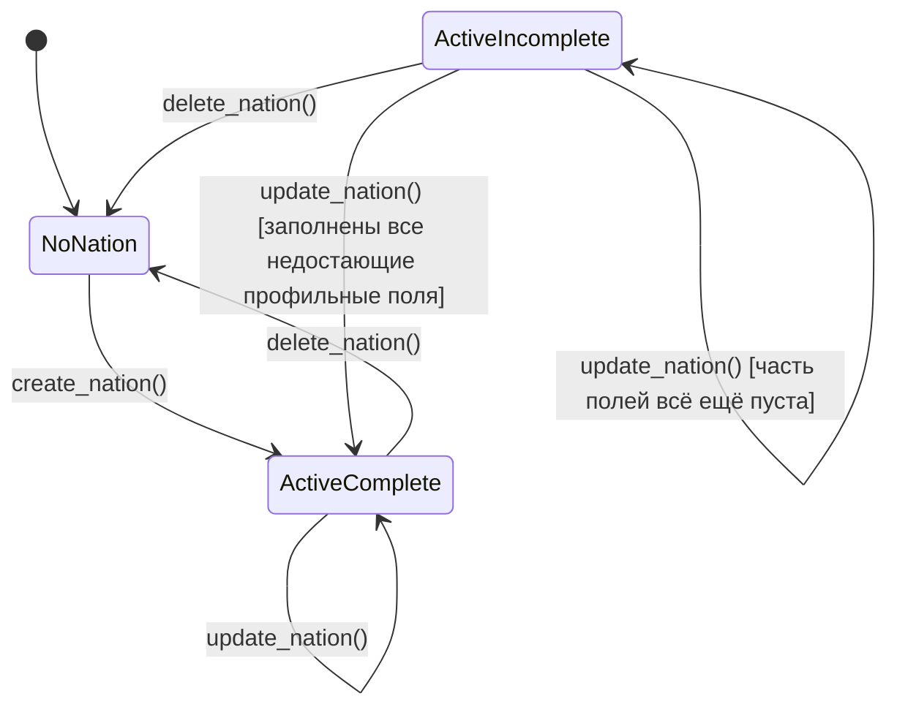
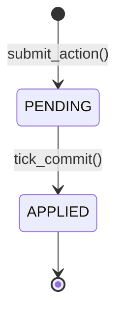
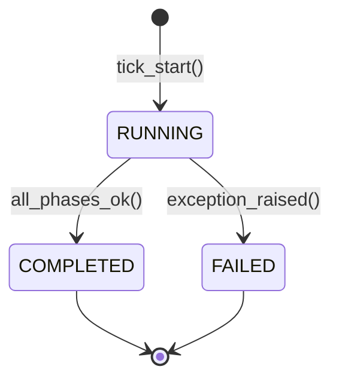

# 02_SYSTEM_SPECS / 00_core

## ЧАСТЬ 1: ДОМЕННАЯ МОДЕЛЬ

> Соответствие русской терминологии Bible и кодовых имён сущностей:
> «Государство» ⇔ `Nation` (не `State` — во избежание конфликта с термином FSM-состояния).

### `players`

| Поле         | Тип         | Ограничения               |
| ------------ | ----------- | ------------------------- |
| `id`         | UUID        | PK, default `uuid4()`     |
| `vk_user_id` | BIGINT      | UNIQUE, NOT NULL          |
| `created_at` | TIMESTAMPTZ | NOT NULL, default `now()` |

### `nations`

| Поле              | Тип          | Ограничения                                                        |
| ----------------- | ------------ | ------------------------------------------------------------------ |
| `id`              | UUID         | PK, default `uuid4()`                                              |
| `owner_player_id` | UUID         | FK → `players.id`, **UNIQUE**, NOT NULL                            |
| `name`            | VARCHAR(100) | UNIQUE, NOT NULL                                                   |
| `color_hex`       | CHAR(7)      | UNIQUE, NOT NULL, формат `#RRGGBB`                                 |
| `leader_name`     | VARCHAR(100) | NULLABLE (NULL только у государств, созданных до миграции профиля) |
| `leader_title`    | VARCHAR(100) | NULLABLE (то же)                                                   |
| `history_url`     | VARCHAR(2000)| NULLABLE (то же)                                                   |
| `created_at`      | TIMESTAMPTZ  | NOT NULL                                                           |

`owner_player_id UNIQUE` — единственный способ жёстко гарантировать инвариант «1 игрок = 0 или 1 государство» на уровне БД, а не только в сервисном слое.

`leader_name`, `leader_title`, `history_url` — описательные сведения (Bible §8). Уникальность и индексы на них не нужны. NULL допустим на уровне БД только ради государств, созданных до миграции; сервис при создании всегда записывает все три значения. Длины колонок (`name`, `leader_name`, `leader_title`, `history_url`) равны верхним границам схемы конфига (`le=100`, `le=100`, `le=100`, `le=2000`), поэтому любое валидное значение конфига помещается в колонку без новой миграции. Миграция добавляет три колонки (в SQLite — через `batch_alter_table`) и не меняет существующие данные.

### `provinces`

| Поле        | Тип     | Ограничения                                     |
| ----------- | ------- | ----------------------------------------------- |
| `id`        | INTEGER | PK, **не UUID** — вводится игроком вручную      |
| `nation_id` | UUID    | FK → `nations.id`, NULLABLE (`NULL` = свободна) |

Строки таблицы создаются миграцией/фикстурой мира на старте проекта, не игроками.

### `scheduled_actions` (универсальный примитив «механического деятельного акта»)

| Поле          | Тип                        | Ограничения                                                 |
| ------------- | -------------------------- | ----------------------------------------------------------- |
| `id`          | UUID                       | PK                                                          |
| `nation_id`   | UUID                       | FK → `nations.id`, NOT NULL                                 |
| `module_slug` | VARCHAR(50)                | NOT NULL — какой модуль владеет актом                       |
| `action_type` | VARCHAR(50)                | NOT NULL — тип акта внутри модуля                           |
| `payload`     | JSONB                      | NOT NULL — данные акта, интерпретируются модулем-владельцем |
| `turn_number` | BIGINT                     | NOT NULL — ход, на который запланирован                     |
| `status`      | ENUM(`PENDING`, `APPLIED`) | NOT NULL, default `PENDING`                                 |
| `created_at`  | TIMESTAMPTZ                | NOT NULL                                                    |
| `applied_at`  | TIMESTAMPTZ                | NULLABLE                                                    |

### `game_clock` (singleton-таблица, всегда ровно одна строка)

| Поле           | Тип         | Ограничения           |
| -------------- | ----------- | --------------------- |
| `id`           | SMALLINT    | PK, `CHECK (id = 1)`  |
| `current_turn` | BIGINT      | NOT NULL, default `0` |
| `last_tick_at` | TIMESTAMPTZ | NULLABLE              |
| `next_tick_at` | TIMESTAMPTZ | NOT NULL              |

`BIGINT` для счётчика хода — защита от переполнения на горизонте многолетней жизни проекта, а не потому что INT реально переполнится.

### `tick_log` (аудит-журнал, вне основной game-транзакции — см. Часть 2)

| Поле            | Тип                                    | Ограничения                 |
| --------------- | -------------------------------------- | --------------------------- |
| `id`            | INTEGER                                | PK                          |
| `turn_number`   | BIGINT                                 | NOT NULL                    |
| `started_at`    | TIMESTAMPTZ                            | NOT NULL                    |
| `finished_at`   | TIMESTAMPTZ                            | NULLABLE                    |
| `status`        | ENUM(`RUNNING`, `COMPLETED`, `FAILED`) | NOT NULL, default `RUNNING` |
| `error_message` | TEXT                                   | NULLABLE                    |

**Правило FK:** прямые внешние ключи из `scheduled_actions`/будущих таблиц-сателлитов допустимы только на `players.id`, `nations.id`, `provinces.id`. Ссылки на `scheduled_actions.id`, `game_clock.id`, `tick_log.id` из других модулей запрещены — это внутренняя бухгалтерия ядра, а не предметные сущности. Несколько записей с одинаковым `turn_number` допустимы (повторные попытки после сбоя); актуальной считается запись с наибольшим `id`.

---

## ЧАСТЬ 2: ИНВАРИАНТЫ, FSM И МЕСТО В TICK DAG

### Инварианты

- **INV-1:** `nations.owner_player_id` уникален — игрок не может владеть двумя государствами одновременно.
- **INV-2:** `nations.name` и `nations.color_hex` уникальны глобально (UNIQUE-констрейнты БД, а не только проверка в сервисе).
- **INV-3:** Создание государства и закрепление провинций — одна атомарная транзакция; частичное закрепление недопустимо (нарушение любого условия откатывает всю операцию).
- **INV-4:** `scheduled_actions` неизменяемы после создания игроком; единственный разрешённый переход статуса — `PENDING → APPLIED`, и выполняет его только тик-оркестратор.
- **INV-5:** `game_clock.current_turn` мутируется исключительно оркестратором тика, монотонно, на `+1`.
- **INV-6:** Удаление государства не удаляет провинции — обнуляет их `nation_id` (провинции переходят в статус свободных).
- **INV-7:** При создании государства `leader_name`, `leader_title`, `history_url` обязательны и проходят проверки Части 3 (нормализация, длины, формат). Ни одно из трёх значений не может быть NULL у государства, созданного после миграции.
- **INV-8:** При изменении `null` или отсутствие поля означает «не менять»; пустая строка (после нормализации) — ошибка, а не очистка. Все три поля обязательные, очистить их нельзя.
- **INV-9:** Проверки профильных полей выполняются в `service.py` (единый источник; коды ошибок — Часть 5). DTO только типизирует поля.
- **INV-10:** На `leader_name`, `leader_title`, `history_url` не накладывается уникальность; они не участвуют в расчётах Tick.
- **Порядок проверок при создании:** INV-1 → профильные поля (имя лидера, должность, ссылка; возвращается первая ошибка) → INV-2 (название, цвет) → количество провинций → существование и свобода провинций.
- **INV-TICK-ATOMICITY:** Весь тик — одна транзакция БД. Необработанное исключение в любом обработчике любой фазы → откат целиком; `current_turn` не увеличивается; все `scheduled_actions` хода остаются `PENDING` и обрабатываются повторно на следующей попытке. Запись в `tick_log` выполняется отдельным соединением/autocommit — вне транзакции тика, — иначе при откате пропадёт и диагностика сбоя.
- **INV-FREQUENCY:** Проверка частоты акта — обязанность `00_core` (реализация), правило частоты — обязанность модуля-владельца (конфигурация). См. алгоритм в Части 3.

### FSM: жизненный цикл государства


```mermaid
stateDiagram-v2
    [*] --> NoNation
    NoNation --> ActiveComplete: create_nation()
    ActiveIncomplete --> ActiveComplete: update_nation() [заполнены все недостающие профильные поля]
    ActiveIncomplete --> ActiveIncomplete: update_nation() [часть полей всё ещё пуста]
    ActiveComplete --> ActiveComplete: update_nation()
    ActiveComplete --> NoNation: delete_nation()
    ActiveIncomplete --> NoNation: delete_nation()
```

`ActiveIncomplete` — производное состояние (хотя бы одно профильное поле NULL), оно не хранится. Оно возможно только у строк, созданных до миграции профиля; `create_nation()` ведёт сразу в `ActiveComplete`. Изменение сведений государства не является механическим деятельным актом: оно применяется немедленно и в `scheduled_actions` не попадает.

### FSM: жизненный цикл механического деятельного акта


```mermaid
stateDiagram-v2
    [*] --> PENDING: submit_action()
    PENDING --> APPLIED: tick_commit()
    APPLIED --> [*]
```

### FSM: жизненный цикл тика


```mermaid
stateDiagram-v2
    [*] --> RUNNING: tick_start()
    RUNNING --> COMPLETED: all_phases_ok()
    RUNNING --> FAILED: exception_raised()
    COMPLETED --> [*]
    FAILED --> [*]
```

### Регистрация в Tick DAG

```python
class TickPhase(IntEnum):
    PHASE_1_ENVIRONMENT = 100
    PHASE_2_PRODUCTION  = 200
    PHASE_3_CONSUMPTION = 300
    PHASE_4_RESOLVE     = 400
    PHASE_5_EXPIRATION  = 500
```

`00_core` **не регистрирует ни одного обработчика** ни в одной из 5 фаз — ни одна игровая механика ядру не принадлежит. Единственная процедура ядра — `finalize_tick()`: инкремент `current_turn`, запись `last_tick_at`/`next_tick_at`, закрытие `tick_log`. Она вызывается оркестратором как финальный шаг **вне** цикла по `TickPhase`, строго после завершения обработчиков `PHASE_5_EXPIRATION`.

Профильные поля государства (лидер, ссылка на историю) в Tick не участвуют: нового шага расчёта и новой регистрации в `TickPhase` они не создают.

**Фазовые зависимости:**

- *Входящие:* отсутствуют — никакой модуль не мутирует таблицы `00_core` напрямую (только через `service.py` ядра).
- *Исходящие:* структурная (не фазовая) зависимость всех модулей-сателлитов от `00_core` — регистрация обработчика в реестре фаз обязана произойти до старта тика, иначе оркестратор модуль не вызовет.

---

## ЧАСТЬ 3: МАТЕМАТИЧЕСКИЙ АППАРАТ

Формульный аппарат `00_core` минимален по конструкции: ядро не считает игровые показатели (это зона модулей-сателлитов), поэтому формул с делением здесь нет и защита от деления на ноль не применима к текущей части — общий паттерн для будущих модулей: `x / max(y, ε)`.

**Момент следующего тика:**
$$
t_{next} = \min\{\, t \in T_{tick} \mid t > t_{now} \,\}
$$
где $T_{tick}$ — множество локальных календарных моментов `tick.tick_time` (строгий формат `HH:MM`) в зоне `tick.tick_timezone`. `next_tick_at` — ближайшее наступление этого времени суток строго после `t_{now}`, вычисленное по локальной календарной дате (никогда не «+24h»): переходы на летнее/зимнее время сдвигают UTC-момент тика, а локальное время остаётся фиксированным. Следствие: ручной запуск тика не сдвигает суточное расписание.

**Игровая дата:**
$$
D_{game} = D_{epoch} + \lfloor N_{turn} \times R_{days} \rfloor
$$
где $D_{epoch}$ = `calendar_epoch_start_date`, $N_{turn}$ = `game_clock.current_turn`, $R_{days}$ = `calendar_days_per_turn`. Округление вниз — защитный паттерн на случай, если `R_days` станет дробным в будущих ревизиях; при целочисленном конфиге эффекта не даёт.

**Свежесть `vk_ts` (Session Auth):**
$$
|\,t_{now} - t_{vk\_ts}\,| \le W_{freshness}
$$
где $W_{freshness}$ = `vk_ts_freshness_window_minutes × 60` (секунды). Модуль абсолютного значения закрывает сразу два случая: устаревший запрос (replay-атака) и запрос с меткой из будущего (рассинхрон часов/подделка).

**Проверка частоты механического акта (INV-FREQUENCY):**
$$
\text{Allow} \iff N_{used}(P, M, A, T) < N_{max}(F)
$$
где $N_{used}$ — число уже существующих `scheduled_actions` для государства $P$, модуля $M$, типа акта $A$ на ходу $T$ (для правила `ONCE_PER_GAME` фильтр по ходу $T$ снимается — считается за всю историю); $N_{max}(F)$ определяется правилом частоты: `ONCE_PER_TURN → 1`, `ONCE_PER_GAME → 1` (без фильтра по ходу), `MULTIPLE_PER_TURN → cap` (числовой лимит модуля-владельца), `UNLIMITED → ∞`.


### Профильные поля государства

Формул с делением здесь нет, защита от деления на ноль не применима. Округления нет.

**Нормализация:** $t = s.\mathrm{strip}()$ (Unicode-пробелы). Длина считается в кодовых точках Unicode ($\lvert t \rvert$ = `len(t)`).

**Текстовое поле** (имя лидера, должность лидера):
$$
\text{valid}(s) \iff L_{\min} \le \lvert t \rvert \le L_{\max} \;\wedge\; \forall c \in t:\ \mathrm{cat}(c) \notin \{\mathrm{Cc}, \mathrm{Cf}\}
$$
Поле однострочное: управляющие символы (включая перевод строки) и невидимые символы форматирования (категории Unicode `Cc`, `Cf`) недопустимы. Пределы $L_{\min}$, $L_{\max}$ берутся из `nation.leader_name_*` и `nation.leader_title_*`. Значение хранится в нормализованном виде (после `strip`).

**Ссылка на историю:** $u = \mathrm{trim}(s)$, разбор — `urllib.parse.urlsplit`:
$$
\text{valid\_url}(u) \iff \lvert u \rvert \le L_{url} \;\wedge\; \text{scheme}=\texttt{https} \;\wedge\; \text{host}\in H \;\wedge\; \text{port},\ \text{userinfo},\ \text{query},\ \text{fragment}=\varnothing \;\wedge\; \text{path} = \texttt{/@}\,\text{slug}
$$
где $H$ — `nation.history_url_allowed_hosts`, хост сравнивается в нижнем регистре, $L_{url}$ — `nation.history_url_max_length`. Путь ($\text{slug}$ — название статьи) должен соответствовать регулярному выражению `^/@[^/\s]+$` (адрес статьи ВКонтакте: знак `@`, затем название без слэшей и пробелов). Пробелы и управляющие символы внутри адреса недопустимы. Ошибка разбора (`ValueError`, например некорректный порт) считается невалидной ссылкой. Значение хранится в том виде, в котором принято после удаления внешних пробелов.

**Известное ограничение:** формат ссылки проверяется, содержимое — нет. Ссылка на чужую статью или на страницу автора `vk.com/@имя` формат проходит (Bible §8, `out_of_scope`).

**Частичное изменение (PATCH):** поле, переданное как не-`null`, проходит те же проверки; `null` или отсутствие поля — поле не меняется.

---

## ЧАСТЬ 4: СПЕЦИФИКАЦИЯ КОНФИГУРАЦИИ

| Ключ                                  | Тип             | Единица       | min | max  | default          |
| ------------------------------------- | --------------- | ------------- | --- | ---- | ---------------- |
| `tick.tick_time`                      | str `HH:MM` 24ч | локальное время | — | —    | **"00:00"**        |
| `tick.tick_timezone`                  | str (IANA zone) | —             | —   | —    | **"Europe/Moscow"** |
| `tick.tick_interval_hours`            | int             | часы (legacy) | 1   | 168  | **24**           |
| `tick.retry_delay_seconds`            | int             | секунды       | 1   | 3600 | **60**           |
| `auth.vk_ts_freshness_window_minutes` | int             | минуты        | 1   | 120  | **30**           |
| `auth.jwt_ttl_minutes`                | int             | минуты        | 5   | 1440 | **60**           |
| `nation.nation_name_min_length`       | int             | символы       | 1   | 10   | **3**            |
| `nation.nation_name_max_length`       | int             | символы       | 1   | 100  | **40**           |
| `nation.min_provinces_per_nation`     | int             | шт.           | 0   | 10   | **1**            |
| `nation.max_provinces_per_nation`     | int             | шт.           | 1   | 200  | **5**            |
| `nation.leader_name_min_length`       | int             | символы       | 1   | 10   | **2**            |
| `nation.leader_name_max_length`       | int             | символы       | 1   | 100  | **60**           |
| `nation.leader_title_min_length`      | int             | символы       | 1   | 10   | **2**            |
| `nation.leader_title_max_length`      | int             | символы       | 1   | 100  | **60**           |
| `nation.history_url_max_length`       | int             | символы       | 30  | 2000 | **200**          |
| `nation.history_url_allowed_hosts`    | list[str]       | имена хостов  | 1 элемент | 10 элементов | **["vk.com", "vk.ru"]** |
| `calendar.epoch_start_date`           | date (ISO 8601) | —             | —   | —    | **"0001-01-01"** |
| `calendar.days_per_turn`              | int             | игровые сутки | 1   | 365  | **7**            |

`tick_interval_hours=24` и `vk_ts_freshness_window_minutes=30` — не мои предположения, а уже зафиксированные в `README.md` («суточный ход») и `development_workflow.md` («свежестью ≤ 30 минут») значения; я их перенёс без изменений. С переходом на суточный тик в фиксированное локальное время `tick_interval_hours` остаётся в конфиге только для миграции 0001 (посев первого `next_tick_at` на свежей БД) — планировщик и `finalize_tick()` используют `tick_time`/`tick_timezone`. `tick.retry_delay_seconds` — пауза перед повторной попыткой тика после сбоя.

**Перекрёстные правила схемы:** `*_min_length ≤ *_max_length`; хосты в `history_url_allowed_hosts` — в нижнем регистре, без схемы, порта и пути, валидные имена хостов, без дублей. Верхние границы `le` текстовых лимитов обязаны быть не больше длин колонок в БД (100 / 100 / 2000); это проверяет тест. Все новые ключи обязательны (значений по умолчанию в схеме нет): пропущенный ключ ломает запуск.

---

## ЧАСТЬ 5: СЕТЕВОЙ И UI КОНТРАКТ

### FastAPI эндпоинты

| Метод  | Путь                 | Авторизация       | Request DTO                    | Response DTO        | Код       |
| ------ | -------------------- | ----------------- | ------------------------------ | ------------------- | --------- |
| POST   | `/api/v1/auth/vk`    | нет (точка входа) | `VkAuthRequest{launch_params}` | `AuthResponseDTO`   | 200       |
| GET    | `/api/v1/players/me` | Bearer            | —                              | `PlayerDTO`         | 200       |
| GET    | `/api/v1/nations/me` | Bearer            | —                              | `NationDTO`         | 200 / 404 |
| GET    | `/api/v1/nations/rules` | Bearer         | —                              | `NationRulesDTO`    | 200       |
| POST   | `/api/v1/nations`    | Bearer            | `NationCreateRequest`          | `NationDTO`         | 201 / 409 / 422 |
| PATCH  | `/api/v1/nations/me` | Bearer            | `NationUpdateRequest`          | `NationDTO`         | 200 / 409 / 422 |
| DELETE | `/api/v1/nations/me` | Bearer            | `{confirm: true}`              | —                   | 204       |
| GET    | `/api/v1/provinces`  | Bearer            | `?ids=&free_only=`             | `List[ProvinceDTO]` | 200       |
| GET    | `/api/v1/game-clock` | Bearer            | —                              | `GameClockDTO`      | 200       |

### DTO

```python
AuthResponseDTO   = { access_token: str, token_type: "bearer", expires_in: int, player: PlayerDTO }
PlayerDTO         = { id: UUID, vk_user_id: int, created_at: datetime }
NationDTO         = { id: UUID, name: str, color_hex: str, owner_player_id: UUID, province_ids: list[int],
                      leader_name: str | None, leader_title: str | None, history_url: str | None,   # None только у государств, созданных до миграции профиля
                      created_at: datetime }
NationCreateRequest = { name: str, color_hex: str, province_ids: list[int],
                        leader_name: str, leader_title: str, history_url: str }                      # три новых поля обязательны
NationUpdateRequest = { name: str | None, color_hex: str | None,
                        leader_name: str | None, leader_title: str | None, history_url: str | None }  # None/отсутствие = не менять
NationRulesDTO    = { name_min_length: int, name_max_length: int,
                      leader_name_min_length: int, leader_name_max_length: int,
                      leader_title_min_length: int, leader_title_max_length: int,
                      history_url_max_length: int, history_url_allowed_hosts: list[str],
                      min_provinces: int, max_provinces: int }                                      # значения из конфига, для подсказок в форме
ProvinceDTO       = { id: int, nation_id: UUID | None }
GameClockDTO      = { current_turn: int, game_date: str, next_tick_at: datetime }
ErrorResponse      = { detail: str, code: str }
```

`color_hex` валидируется regex-паттерном `^#[0-9A-Fa-f]{6}$` на уровне DTO — это не балансовое число, поэтому в YAML не выносится. Длина названия также проверяется на уровне DTO по конфигу. Ошибки типов и формата DTO (`color_hex`, длина названия, тело запроса) FastAPI возвращает в стандартном формате 422; профильные поля государства проверяет сервис, и их ошибки приходят в формате `ErrorResponse`.

### Коды ошибок (`ErrorResponse.code`)

| code | HTTP | Когда |
| --- | --- | --- |
| `NAME_TAKEN` | 409 | название государства занято |
| `COLOR_TAKEN` | 409 | цвет государства занят |
| `PROVINCE_TAKEN` | 409 | провинция уже закреплена за другим государством |
| `PROVINCE_NOT_FOUND` | 404 | провинции не существует |
| `PROVINCE_COUNT_OUT_OF_RANGE` | 422 | количество провинций вне границ конфига |
| `NATION_ALREADY_EXISTS` | 409 | игрок уже владеет государством |
| `NATION_NOT_FOUND` | 404 | у игрока нет государства |
| `LEADER_NAME_INVALID` | 422 | имя лидера пусто, вне границ длины или содержит недопустимые символы |
| `LEADER_TITLE_INVALID` | 422 | то же для должности лидера |
| `HISTORY_URL_INVALID` | 422 | ссылка пуста, длиннее лимита или не проходит формат (`detail` называет причину) |
| `INVALID_SIGNATURE` | 401 | подпись launch-параметров неверна |
| `TIMESTAMP_EXPIRED` | 401 | `vk_ts` вне окна свежести |
| `UNAUTHORIZED` | 401 | отсутствует или недействителен Bearer-токен |
| `GAME_CLOCK_NOT_FOUND` | 404 | не инициализирован `game_clock` |
| `FREQUENCY_CAP_EXCEEDED` | — | превышен лимит частоты механического акта (внутренний, наружу через эндпоинты `00_core` не отдаётся) |

Статусы кодов регистрируются в таблице соответствия `main.py`; код без записи в ней вернулся бы как 500.

### Панели VKUI (desktop; тексты на русском)

- **Auth-gate** — невидимая, `ScreenSpinner` на время резолва `/auth/vk`.
- **`PanelCreateNation` — контейнер из двух окон.** Номер текущего шага (1 или 2) и все введённые значения хранятся в контейнере: переключение окон их не теряет и ничего не отправляет на сервер.
  - Окно 1 «Основная информация»: `FormItem`(название, `Input`), `FormItem`(цвет, цветовой пикер), `FormItem`(провинции, `ChipsInput` с числовым вводом и справочным списком свободных ID), `FormItem`(имя лидера, `Input`), `FormItem`(должность лидера, `Input`).
  - Окно 2 «История государства»: `FormItem`(ссылка на статью ВКонтакте, `Input`) с подсказкой формата (`https://vk.com/@название-статьи`) и пометкой «обязательно».
  - Навигация: кнопки-стрелки «назад»/«вперёд» (`IconButton`, иконки `@vkontakte/icons`) и текст «Шаг 1 из 2». Если сервер вернул ошибку по полю другого окна, у этого шага отображается индикатор ошибки (например, VKUI `Badge`); окно автоматически не переключается.
  - Кнопка подтверждения доступна в обоих окнах, неактивна, пока обязательные поля пусты; отправляется один `POST /api/v1/nations` с данными обоих окон.
  - Ошибки — `FormStatus` инлайн по конкретному полю: `NAME_TAKEN` → название, `COLOR_TAKEN` → цвет, `PROVINCE_*` → провинции, `LEADER_NAME_INVALID` → имя лидера, `LEADER_TITLE_INVALID` → должность, `HISTORY_URL_INVALID` → ссылка (окно 2).
  - Лимиты и подсказки (длины, допустимые хосты, границы числа провинций) берутся из `GET /api/v1/nations/rules`, один запрос при открытии панели; числа в клиенте не дублируются.
- **`PanelNationHome`** — `Group` с `Header`(номер хода и игровая дата), `SimpleCell`(название, цветовой `Div`-свотч, список ID провинций, имя и должность лидера), ссылка на историю (`<a target="_blank" rel="noopener noreferrer">`; пустое значение у старых государств показывается как «не указано»), `Button`(редактировать), `Button`(удалить, деструктивный стиль). Редактирование — одна форма: название, цвет, имя лидера, должность, ссылка; отправляются только изменённые поля, незаполненные у старого государства поля не мешают сохранить остальное.
- **`ModalConfirmDeleteNation`** — `ModalPage`/`ModalCard` с явным предупреждением о необратимости и кнопкой подтверждения.

### `vk-bridge`

- `VKWebAppInit` — обязательный вызов при старте клиента.
- `VKWebAppTapticImpactOccurred` — тактильный отклик на submit создания/удаления государства.
- Лаунч-параметры **не запрашиваются через bridge** — читаются напрямую из `window.location.search`, они уже присутствуют в URL при открытии мини-аппа (см. `technical_blueprint.md`, п.3.1).
