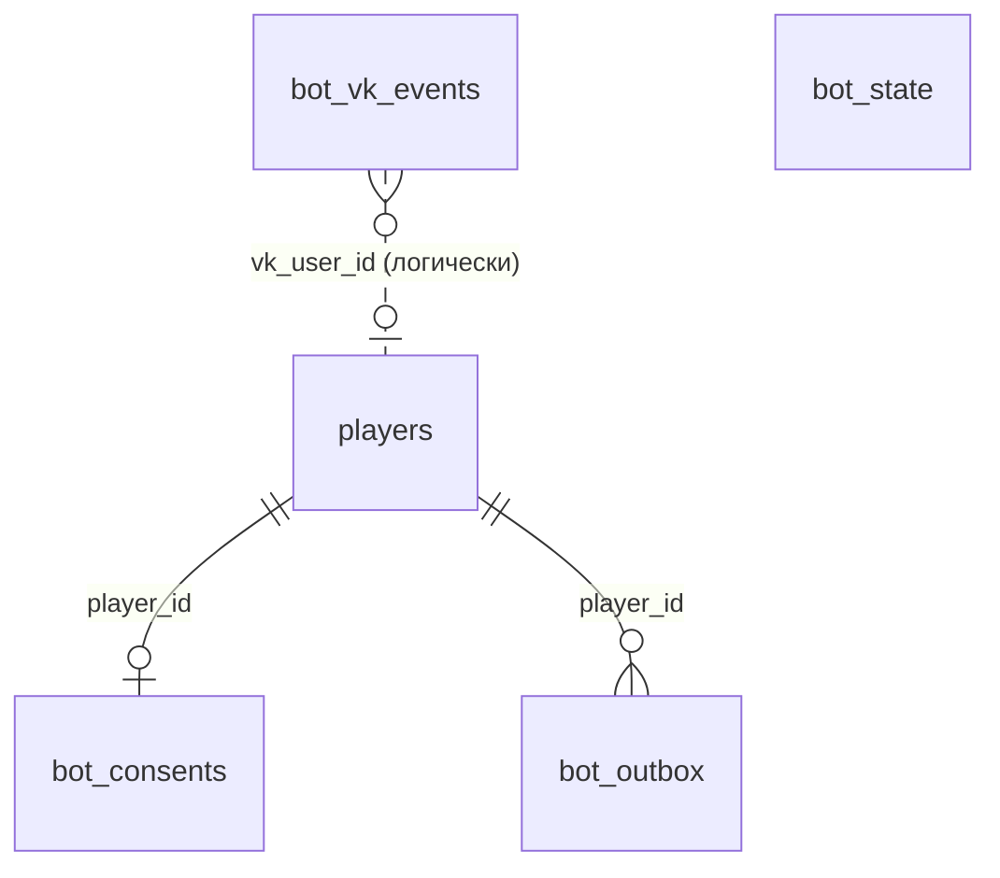
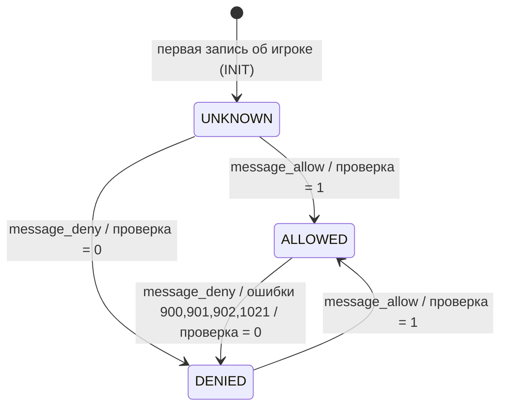
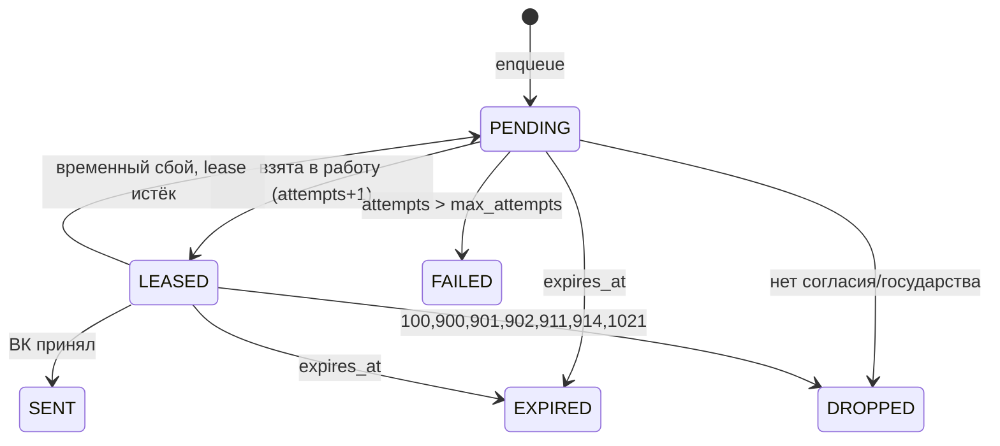

# 02_SYSTEM_SPECS / 02_bot

> **Версия:** 1.1 (после проверки фактов ВК, задачи BOT-0 и BOT-0b: `docs/02_SYSTEM_SPECS/02_bot_vk_facts.md`, и перепроектирования контура согласия). **Основа:** `docs/01_GAME_BIBLE/02_bot.md`.
> **Что изменилось в 1.1 относительно 1.0:** согласие даётся в чате с сообществом, а не системным окном ВК (D6); регистрация государства требует согласия, с аварийным выключателем и fail-open (D7); две клавиатуры из двух кнопок вместо трёх рядов (D3); хост API `api.vk.ru`, потолок скорости 20 запросов/с, коды ошибок 27, 28, 984, 1021, разбор ответа с `peer_ids`, события Callback и расписание повторов ВК; новая секция `client` и ключ `consent.required_for_registration` в конфиге; новый ответ `GET /bot/status`; Приложение V заменено итогами проверки.
> Пакеты и пути: бэкенд `backend/src/modules/_02_bot/`, фронтенд `frontend/src/modules/02_bot/`, конфиг `configs/02_bot.yaml`, схема `backend/src/modules/_02_bot/config_schema.py`.
> Терминология: «сообщество» — сообщество ВК, от имени которого пишет бот; «игрок» — строка `players`; «получатель» — игрок с государством и разрешением; «очередь» — таблица `bot_outbox`; «звонок» — сигнал `asyncio.Event`, будящий отправщик.

## 0. Принятые архитектурные решения (отклонения от Bible и от «буквы» шаблона)

| №  | Решение | Почему |
| :-- | :-- | :-- |
| **D1** | У модуля **нет обработчика в Tick DAG** (`tick_phase: NONE`). Суточная сводка создаётся фоновым «наблюдателем» **после** фиксации хода: он замечает, что `game_clock.current_turn` вырос, и ставит сводки в очередь. | Bible предполагала обработчик в `PHASE_5_EXPIRATION`. Но тогда код бота выполнялся бы внутри транзакции хода: любая ошибка бота откатывала бы ход, а порядок «последним в фазе» пришлось бы охранять. Наблюдатель делает невозможным само влияние бота на ход. Цена: сводка уходит на 1–5 секунд позже, что для игрока незаметно. |
| **D2** | Игрок создаётся записью `players` по событиям ВК (`message_allow`, `message_new`) через публичный `PlayerService.get_or_create` ядра. | Таблица согласий связана внешним ключом только с `players`. Человек может написать боту раньше, чем впервые откроет приложение. Лишних строк немного: только те, кто сам обратился к сообществу. |
| **D3** | Кнопки — **стандартная постоянная клавиатура** ВК (`inline = false`): она встроена в интерфейс чата, один раз показывается внизу, а не под каждым сообщением. Две клавиатуры из двух кнопок: у игрока с государством — «Статус» и «Помощь»; у игрока без государства — «Создать государство» и «Помощь». ВК устанавливает клавиатуру, когда она передана в `messages.send`, и держит её, пока не придёт замена или `{buttons: []}` (V9); поэтому бот передаёт клавиатуру с каждым исходящим сообщением, а вариант выбирает при отправке по наличию государства. Ответ на «Помощь» дополнительно несёт инлайн-кнопки-ссылки («Правила», «Регламент», «Связаться с администрацией»); они не снимают постоянную панель. | Минимум кнопок — минимум путаницы. Связь с администрацией не нужна на виду постоянно: она в «Помощи», и плашка на свободный текст отсылает именно туда. |
| **D4** | Очередь — таблица PostgreSQL, отправщик — одна фоновая задача, пробуждаемая «звонком» после фиксации транзакции продюсера плюс опрос раз в `poll_interval_seconds`. | Redis/Celery не нужны: сервер один, нагрузка — десятки сообщений в секунду, а транзакционная запись события и сообщения в одну БД невозможна с внешней очередью без потери гарантий. |
| **D5** | Склейка выполняется **в момент отправки**, а не при постановке: строка очереди = одно событие; одно сообщение ВК = «группа» строк. | Позволяет применять лимиты по актуальному состоянию и не плодить «слитые» строки. Группа получает постоянный `random_id`, чтобы повторная отправка была безопасна. |
| **D6** | **Согласие даётся в чате с сообществом, а не системным окном ВК.** Игрок открывает чат по ссылке `chat_url` (`https://vk.com/write-{group_id}`, V15) и нажимает «Начать»: ВК присылает `message_allow` и `message_new` с `{"command":"start"}` (V16). Вызов `VKWebAppAllowMessagesFromGroup` модуль **не использует**: он работает только у приложения, прошедшего модерацию ВК (V8, V18), а владелец проекта её проходить не будет; VK Bridge для этого вообще не нужен. | Путь через чат документирован, не требует модерации и покрывается событиями Callback. |
| **D7** | **Регистрация государства требует согласия на сообщения**, если бот включён и настроен и `consent.required_for_registration = true`. Без согласия вместо формы показывается экран «Авторизоваться в боте» (кнопка-ссылка в чат, без автоматического перехода, п. 5.6); сервер дублирует проверку (`CONSENT_REQUIRED`, п. 3.10). Если ВК недоступен, регистрация **не блокируется** (fail-open). Игроков, у которых государство уже есть, это правило не затрагивает: им показывается мягкая подсказка. | Без согласия сводки и тревоги не дойдут, поэтому согласие нужно в момент входа в игру. Но зависимость регистрации от внешнего сервиса не должна ломать игру: есть выключатель в конфиге и fail-open. |

---

## ЧАСТЬ 1: ДОМЕННАЯ МОДЕЛЬ

### 1.1. Таблицы БД

Все таблицы новые (миграция только добавляет). Внешние ключи — исключительно к `players.id` (INV-B11). Идентификаторы игроков — `VARCHAR(36)`, как в `00_core`.

#### `bot_consents` — согласие игрока на сообщения от сообщества

| Поле | Тип | Ограничения |
| :-- | :-- | :-- |
| `player_id` | VARCHAR(36) | PK, FK → `players.id` ON DELETE CASCADE |
| `state` | VARCHAR(8) | NOT NULL, default `'UNKNOWN'`, `CHECK (state IN ('UNKNOWN','ALLOWED','DENIED'))` |
| `state_source` | VARCHAR(24) | NOT NULL. Один из: `INIT`, `VK_EVENT`, `VK_CHECK`, `VK_ERROR_900`, `VK_ERROR_901`, `VK_ERROR_902`, `VK_ERROR_1021` |
| `state_changed_at` | TIMESTAMPTZ | NOT NULL |
| `last_checked_at` | TIMESTAMPTZ | NULL — время последней сверки с ВК методом `isMessagesFromGroupAllowed` |
| `last_plate_at` | TIMESTAMPTZ | NULL — время последней плашки на свободный текст (для паузы `dialog.plate_cooldown_minutes`) |
| `created_at` | TIMESTAMPTZ | NOT NULL |

#### `bot_outbox` — очередь исходящих сообщений

| Поле | Тип | Ограничения |
| :-- | :-- | :-- |
| `id` | BIGINT | PK, autoincrement (на SQLite — INTEGER через `with_variant`). **Не используется** для `random_id` и не показывается игроку |
| `player_id` | VARCHAR(36) | NOT NULL, FK → `players.id` ON DELETE CASCADE |
| `kind` | VARCHAR(12) | NOT NULL, `CHECK (kind IN ('NOTIFICATION','REPLY'))`. `REPLY` — ответ в диалоге |
| `type_key` | VARCHAR(40) | NOT NULL. Ключ типа из каталога; для `REPLY` — `'DIALOG'` |
| `event_key` | VARCHAR(120) | NOT NULL. Ключ события для защиты от дубля |
| `priority` | VARCHAR(8) | NOT NULL, `CHECK (priority IN ('critical','normal'))` |
| `counts_toward_cap` | BOOLEAN | NOT NULL. Копия правила типа на момент постановки |
| `payload` | JSON | NOT NULL. Для `NOTIFICATION` — словарь переменных шаблона. Для `REPLY` — `{"template": "<имя из dialog.texts>", "vars": {…}, "keyboard": "AUTO"|"HELP"}`: `AUTO` — постоянная клавиатура `MEMBER`/`GUEST` по состоянию игрока в момент отправки, `HELP` — инлайн-клавиатура ссылок «Помощи» (п. 5.5) |
| `status` | VARCHAR(8) | NOT NULL, default `'PENDING'`, `CHECK (status IN ('PENDING','LEASED','SENT','EXPIRED','DROPPED','FAILED'))` |
| `drop_reason` | VARCHAR(24) | NULL. Для `DROPPED`/`FAILED`: `NO_CONSENT`, `NO_NATION`, `BLOCKED`, `TEMPLATE_ERROR`, `BAD_REQUEST`, `TOO_LONG`, `ATTEMPTS_EXHAUSTED`, `RESET` |
| `created_at` | TIMESTAMPTZ | NOT NULL |
| `not_before` | TIMESTAMPTZ | NOT NULL — выдержка (`hold_seconds`) |
| `expires_at` | TIMESTAMPTZ | NOT NULL |
| `attempts` | SMALLINT | NOT NULL, default 0. Растёт **в момент взятия в работу** (ограничивает «петлю падений») |
| `next_attempt_at` | TIMESTAMPTZ | NOT NULL — не раньше этого времени строка готова к отправке |
| `lease_until` | TIMESTAMPTZ | NULL |
| `lease_token` | VARCHAR(36) | NULL |
| `group_id` | VARCHAR(36) | NULL — общий для строк одного сообщения ВК |
| `random_id` | INTEGER | NULL — `random_id` сообщения ВК, один на группу (INV-B6) |
| `render_mode` | VARCHAR(8) | NULL: `SINGLE` / `BATCH` / `SUMMARY` — как строка вошла в сообщение |
| `vk_message_id` | BIGINT | NULL |
| `sent_at` | TIMESTAMPTZ | NULL |
| `last_error_code` | INTEGER | NULL — код последней ошибки ВК; для сетевых сбоев `0` |

Ограничения и индексы:

- `uq_bot_outbox_dedup UNIQUE (player_id, type_key, event_key)` — «одно событие — одно сообщение» (INV-B5).
- `ix_bot_outbox_ready (status, next_attempt_at)` — выбор готовых строк.
- `ix_bot_outbox_player_status (player_id, status, sent_at)` — подсчёт потолка и окон.

#### `bot_vk_events` — журнал входящих событий Callback API

| Поле | Тип | Ограничения |
| :-- | :-- | :-- |
| `id` | BIGINT | PK, autoincrement |
| `event_id` | VARCHAR(64) | NOT NULL, `UNIQUE` — идентификатор события от ВК; повторная доставка не обрабатывается дважды |
| `event_type` | VARCHAR(32) | NOT NULL |
| `vk_user_id` | BIGINT | NULL. **Логическая** связь с `players.vk_user_id`, без внешнего ключа |
| `received_at` | TIMESTAMPTZ | NOT NULL |

Текст сообщений игроков **нигде не сохраняется** (INV-B12).

#### `bot_state` — единственная строка состояния модуля

| Поле | Тип | Ограничения |
| :-- | :-- | :-- |
| `id` | SMALLINT | PK, `CHECK (id = 1)` |
| `last_digest_turn` | INTEGER | NOT NULL, default 0 — последний ход, для которого поставлены сводки |

Строка `id = 1` вставляется той же миграцией.

### 1.2. Связи



### 1.3. Что модуль читает у других (только публичные функции сервисов 00_core)

| Данные | Для чего |
| :-- | :-- |
| Игрок по `vk_user_id`; создание игрока | События ВК (D2) |
| Государство игрока: название, `leader_name`, `leader_title`, число провинций | Сводка, «Статус», проверка «есть ли государство» |
| `game_clock`: `current_turn`, `last_tick_at`, `next_tick_at`; `compute_game_date`; форматирование времени | Сводка, «Статус», наблюдатель |

Если в `00_core` нет подходящей публичной функции чтения, агент **добавляет её в `service.py` ядра** отдельным коммитом (см. Приложение B), а не читает таблицы напрямую в обход сервиса.

### 1.4. Переменные окружения

| Переменная | Значение по умолчанию | Назначение |
| :-- | :-- | :-- |
| `BOT_ENABLED` | `false` | Главный выключатель (INV-B10) |
| `VK_GROUP_ID` | — | Числовой идентификатор сообщества |
| `VK_GROUP_TOKEN` | — | Ключ доступа сообщества (секрет) |
| `VK_CALLBACK_SECRET` | — | Секретный ключ Callback API (секрет) |
| `VK_CALLBACK_CONFIRMATION` | — | Строка подтверждения сервера, которую ВК показывает в **веб-интерфейсе** настроек Callback API сообщества (строка из `groups.getCallbackConfirmationCode` отличается от показанной в интерфейсе, V2) |
| `VK_APP_ID` | — | Идентификатор мини-приложения для кнопки «Создать государство» (`open_app`). Пусто ⇒ кнопка не показывается, в журнал пишется WARNING. Агент сверяет имя с `.env.prod.example`; если переменной там ещё нет — добавляет с пустым значением в Issue диалога |

Если `BOT_ENABLED=true`, но хотя бы одна из четырёх переменных `VK_GROUP_*`/`VK_CALLBACK_*` пуста, бот **остаётся выключенным**, сервер запускается, в журнал пишется строка уровня CRITICAL с перечнем недостающих имён (значения не пишутся), статус в админ-панели — `MISCONFIGURED`. Игра важнее бота. Режимы бота: `OFF` (`BOT_ENABLED=false`), `MISCONFIGURED`, `READY` (настроен; фоновые задачи не запущены), `RUNNING` (задачи запущены). Бот считается **активным** в режимах `READY` и `RUNNING`.

---

## ЧАСТЬ 2: ИНВАРИАНТЫ, FSM И МЕСТО В TICK DAG

### 2.1. Место в Tick DAG

**Обработчиков `TickOrchestrator.register(...)` модуль не регистрирует.** Входящие и исходящие фазовые зависимости отсутствуют. Единственная связь с тиком — чтение: наблюдатель (п. 2.5) читает `game_clock.current_turn` **после** фиксации транзакции хода. Откат хода не оставляет следов в очереди бота: до коммита наблюдатель не видит нового номера хода.

Остальные модули ставят сообщения в очередь **в собственной транзакции**, в том числе из обработчиков своих фаз (INV-B1), — это единственное допустимое «вхождение» бота в тик, и оно сводится к вставке одной строки без обращения к ВК.

### 2.2. Инварианты

| № | Инвариант |
| :-- | :-- |
| **INV-B1** | `BotService.enqueue` работает в транзакции вызывающего, не коммитит, не обращается к сети и **не бросает доменных исключений**: неподходящий случай возвращается значением `EnqueueResult`. Откат транзакции продюсера откатывает и строку очереди. Исключения БД не перехватываются (транзакция и так сломана). |
| **INV-B2** | Сбой любого компонента бота (ВК, отправщик, наблюдатель, Callback) не влияет на расчёт хода и не меняет состояние игры. Бот не вызывает мутаций `00_core`, кроме `PlayerService.get_or_create`. |
| **INV-B3** | Уведомление (`kind = NOTIFICATION`, `requires_consent`) не уходит игроку, чьё согласие не `ALLOWED`: проверка при постановке **и** повторная при взятии в работу. |
| **INV-B4** | Суточный потолок обычных сообщений соблюдается строго: число отправленных сообщений с `counts_toward_cap` за скользящие 24 часа не превышает `limits.daily_cap_normal` (сводное сообщение занимает последний слот, п. 3.4). Критические сообщения и ответы диалога в потолке не участвуют. |
| **INV-B5** | `UNIQUE (player_id, type_key, event_key)`: повторная постановка того же события возвращает `DUPLICATE` и не создаёт строки. Ключ события задаёт продюсер, он стабилен и детерминирован (например, `turn:12`, `dispatch:<uuid>`). |
| **INV-B6** | `random_id` — случайное 31-битное число, присваивается **группе** при взятии в работу и сохраняется в той же транзакции **до** запроса к ВК. Он не вычисляется из `id` строк (сброс мира обнуляет счётчик `id`). Повтор отправки той же группы использует тот же `random_id`; при изменении состава группы `random_id` создаётся заново. |
| **INV-B7** | Транзакция БД не удерживается во время запроса к ВК: «взять в работу» (коммит) → «отправить» → «записать результат» (новая транзакция). |
| **INV-B8** | Сообщение с `expires_at <= now` не отправляется. Проверка выполняется при взятии в работу и ещё раз непосредственно перед запросом (после ожидания ограничителя скорости). |
| **INV-B9** | Секреты (`VK_GROUP_TOKEN`, `VK_CALLBACK_SECRET`) не попадают в логи, ошибки, ответы API и URL. Ключ сообщества передаётся заголовком `Authorization: Bearer` (подтверждено, V3). Секрет Callback сравнивается за постоянное время (`hmac.compare_digest`). |
| **INV-B10** | Бот выключен по умолчанию: при `BOT_ENABLED=false` не запускаются фоновые задачи, `enqueue` возвращает `SKIPPED_BOT_OFF` **без записи в БД**, публичный Callback отвечает 404. Миграция только добавляет таблицы. Конфиг при этом всё равно загружается и валидируется. |
| **INV-B11** | Внешние ключи модуля — только к `players.id`. Данные других модулей читаются через их публичные сервисы. |
| **INV-B12** | Свободный текст игрока не сохраняется и не повторяется ботом. Значения переменных шаблона (названия государств, заголовки директив) проходят очистку (п. 3.6); текст другого игрока в сообщение не попадает (принцип Bible §0). |
| **INV-B13** | Состояние бота не влияет на `/api/v1/health`. Признак «жив» отправщика и счётчики сбоев видны только в админ-панели (п. 5.4). |
| **INV-B14** | Сброс мира очищает очередь и обнуляет `bot_state.last_digest_turn`; согласия и журнал входящих событий сохраняются. |
| **INV-B15** | Требование согласия при регистрации (п. 3.10) действует только в режимах `READY`/`RUNNING` при `consent.required_for_registration = true`. Недоступность ВК, `HALTED_AUTH`, открытый аварийный выключатель или любая ошибка проверки **никогда** не блокируют регистрацию (fail-open, запись в журнал уровня WARNING). Блокирует только прямой ответ ВК «разрешения нет». |

### 2.3. FSM согласия (`bot_consents.state`)



Правила:

- Источники в порядке доверия: ответ `isMessagesFromGroupAllowed` (`VK_CHECK`) ≥ событие Callback (`VK_EVENT`) ≥ ошибка отправки. Побеждает последняя запись; расхождение со временем лечит сверка (п. 3.7).
- `message_allow` приходит в двух случаях (V16): игрок нажал «Разрешить сообщения» **или** написал первое сообщение сообществу; нажатие «Начать» — это первое сообщение, поэтому ВК присылает и `message_allow`, и `message_new`. Поэтому единственный первичный сигнал перехода в `ALLOWED` — `message_allow`. Событие `message_new` состояние согласия **не меняет**: для ответов диалога согласие не нужно (V7), а потерянный `message_allow` восстанавливает сверка.
- Игрок может передумать: `DENIED → ALLOWED` по новому `message_allow` (V19). Закрытие или удаление диалога запретом **не является**: состояние не сбрасывается, арбитр — `isMessagesFromGroupAllowed`.
- Ошибка 1021 («нет диалога с сообществом») переводит согласие в `DENIED` с источником `VK_ERROR_1021`; вернуть его может только новое `message_allow`.
- Клиентскому «я включил» не верим: клиент лишь просит сервер выполнить проверку (п. 5.2).
- Любой переход в `DENIED` помечает ожидающие `NOTIFICATION` игрока как `DROPPED / NO_CONSENT`. Переход в `ALLOWED` ничего не воскрешает (Bible §1: «после включения игрок получает только новые»).
- Первая запись создаётся в `UNKNOWN` с `state_source = INIT`.

### 2.4. FSM строки очереди (`bot_outbox.status`)



Терминальные состояния: `SENT`, `EXPIRED`, `DROPPED`, `FAILED`. Завершённые строки удаляются через `sender.purge_after_days`.

### 2.5. Фоновые задачи и порядок запуска

Запуск в `lifespan` приложения (рядом с планировщиком тика) строго в таком порядке:

1. Загрузить и провалидировать `BotConfig` (ошибка прерывает запуск — Config-Safe). Выполняется всегда, даже при `BOT_ENABLED=false`.
2. `register_bot_hooks()` (идемпотентно): админ-хуки сброса и просмотра состояния; сверка реестра типов (п. 2.6); регистрация встроенных типов.
3. Если бот включён и настроен — создать `BotRuntime` и запустить четыре задачи `asyncio`:
   - **sender** — отправщик (п. 3.1–3.5);
   - **digest_watcher** — наблюдатель за номером хода, заодно создаёт предупреждения о дедлайне (п. 3.8);
   - **consent_reconciler** — фоновая сверка разрешений (п. 3.7);
   - **janitor** — очистка (раз в час): удаление завершённых строк очереди и событий старше `sender.purge_after_days`, возврат строк с истёкшей арендой в `PENDING`.
4. При остановке: отменить задачи, дождаться их завершения, вернуть свои `LEASED`-строки в `PENDING` (best effort; при падении процесса их вернёт аренда).

Каждая задача обёрнута в цикл «выполнить шаг → при `Exception` залогировать и подождать (5 → 60 с, экспоненциально) → продолжить»: задача не умирает от одной ошибки; `CancelledError` пробрасывается. Признак «жив» — отметка времени последнего успешного прохода каждой задачи (INV-B13).

Один рабочий процесс — штатный режим (docker compose запускает один worker). При запуске нескольких процессов система остаётся корректной: строки берутся `FOR UPDATE SKIP LOCKED` с арендой, наблюдатель защищён сравнением-и-заменой `UPDATE bot_state SET last_digest_turn = :n WHERE last_digest_turn < :n` (побеждает один процесс), а `random_id` и аренда не допускают двойной отправки.

### 2.6. Реестры расширения (публичный API для будущих модулей)

Определены в `backend/src/modules/_02_bot/registry.py`, экспортируются через `service.py`.

| Реестр | Вызов | Правило |
| :-- | :-- | :-- |
| Типы уведомлений | `register_notification_type(key: str, variables: frozenset[str])` | Модуль-владелец вызывает при запуске. Ключ обязан присутствовать в `configs/02_bot.yaml → types`; множество плейсхолдеров шаблонов типа обязано быть подмножеством `variables` (для `batch_text`/`line_text` добавляется `count`). Нарушение прерывает запуск. Встроенные типы бот регистрирует сам (`BUILTIN_TYPE_VARIABLES` в схеме). Тип из конфига, который никто не зарегистрировал, допустим (ждёт модуль) и просто не используется |
| Аудитория дедлайна | `register_deadline_audience(provider)` где `provider: async (session, turn: int) -> set[str]` возвращает `player_id` игроков, **ещё не совершивших действий на ходе** | На старте провайдеров нет, тип `DEADLINE_WARNING` выключен. Несколько провайдеров объединяются по ИЛИ |

Единственный способ создать уведомление из другого модуля — `BotService.enqueue` (Приложение A).

### 2.7. Реакция на ошибки ВК

Таблица проверена по справочнику ошибок ВК (V5, V11).

| Код/ситуация | Класс | Действие |
| :-- | :-- | :-- |
| Сеть, таймаут, HTTP 5xx, код 1, 10, формат ответа не распознан | системный сбой | Повтор с экспоненциальной паузой; учитывается в аварийном выключателе |
| 6, 29 | лимит частоты (общий) | Отправщик замедляется: общая пауза `sender.backoff_base_seconds`, строки возвращаются в `PENDING`; в выключателе учитывается |
| 9 | флуд-контроль (по игроку) | Строки этого игрока откладываются по экспоненте; в выключателе не учитывается |
| 984 | «спам-ограничение» ВК на отправителя | Как системный сбой (повтор с паузой, учитывается в выключателе: серия таких ответов открывает его и останавливает отправку), плюс запись уровня CRITICAL в журнал |
| 900, 901 | игрок не разрешал / заблокировал | Согласие → `DENIED` (`VK_ERROR_900`/`VK_ERROR_901`), ожидающие `NOTIFICATION` игрока → `DROPPED / BLOCKED`; без повторов |
| 902 | приватность игрока запрещает | То же с `VK_ERROR_902` |
| 1021 | у игрока нет диалога с сообществом | Согласие → `DENIED` (`VK_ERROR_1021`), строки игрока → `DROPPED / NO_CONSENT`; без повторов |
| 5, 7, 15, 27, 28 | ключ недействителен или без прав | Отправщик переходит в `HALTED_AUTH` и перестаёт слать до перезапуска; CRITICAL в журнал; в выключателе не учитывается |
| 100 | неверный параметр запроса | Строки → `DROPPED / BAD_REQUEST`, ошибка в журнал (без текста сообщения); в выключателе **учитывается** (массовые 100 = ошибка кода) |
| 911 | неверный формат клавиатуры | `DROPPED / BAD_REQUEST`, в выключателе учитывается |
| 914 | сообщение слишком длинное | `DROPPED / TOO_LONG` |
| Любой другой код | неизвестный | Как системный сбой; после `sender.max_attempts` → `FAILED` |

Код ошибки получателя берётся из `response[0].error.code` (п. 3.3), код ошибки вызова — из `error.error_code` верхнего уровня; классификация одна и та же.

---

## ЧАСТЬ 3: АЛГОРИТМЫ И МАТЕМАТИЧЕСКИЙ АППАРАТ

Обозначения: $t$ — текущее время (UTC); $R$ — `sender.max_requests_per_second`; $B$ — `sender.claim_batch_size`; $c$ — `sender.concurrency`; $T_h$ — `vk.http_timeout_seconds`; $C_d$ — `limits.daily_cap_normal`; для типа $k$: $\mathrm{ttl}_k$, $h_k$ (`hold_seconds`), $M_k$ (`max_per_window`), $w_k$ (`window_minutes`).

### 3.1. Постановка в очередь (`enqueue`)

Шаги (в транзакции вызывающего):

1. Бот выключен → `SKIPPED_BOT_OFF` (без записи).
2. Тип не зарегистрирован, набор переменных не совпадает с зарегистрированным, значение не `str|int` → ошибка в журнал, `REJECTED_INVALID`.
3. Тип выключен в конфиге → `SKIPPED_TYPE_DISABLED`.
4. У игрока нет государства или согласие ≠ `ALLOWED` (для типов с `requires_consent`) → `SKIPPED_NO_CONSENT` / `SKIPPED_NO_NATION`. Строка не создаётся.
5. Вставка строки со значениями:

$$\texttt{not\_before}=t+h_k,\qquad \texttt{expires\_at}=t_0+60\cdot\mathrm{ttl}_k,\qquad \texttt{next\_attempt\_at}=\texttt{not\_before}$$

где $t_0$ — момент события (по умолчанию $t$; для сводки — `game_clock.last_tick_at`, чтобы устаревшая после простоя сводка не ожила). Нарушение `UNIQUE` (вставка через `INSERT … ON CONFLICT DO NOTHING` / `SAVEPOINT`) → `DUPLICATE`. Успех → `QUEUED`.
6. После успешной вставки регистрируется одноразовый обработчик `after_commit` сессии, который вызывает `runtime.wake()`. Откат транзакции обработчик не вызывает. Если вызывающий не использует обычный коммит сессии, наблюдается задержка не более `sender.poll_interval_seconds` (опрос).

Значения переменных проходят очистку при **отправке** (п. 3.6), хранятся как переданы.

### 3.2. Взятие в работу (claim)

Шаг короткой транзакции, повторяется отправщиком по «звонку» или раз в `poll_interval_seconds`:

1. **Просрочка.** `UPDATE bot_outbox SET status='EXPIRED' WHERE status IN ('PENDING','LEASED') AND expires_at <= t` (для `LEASED` — только с истёкшей арендой).
2. **Исчерпание попыток.** Строки `PENDING` с `attempts >= sender.max_attempts` → `FAILED / ATTEMPTS_EXHAUSTED`.
3. **Готовые строки.** Готова строка, если: `status='PENDING'` (или `LEASED` с `lease_until <= t`) и `not_before <= t` и `next_attempt_at <= t`.
4. **Выбор игроков.** Из готовых строк выбираются не более $B$ игроков в порядке

$$\text{ключ}(p)=\bigl(\ \text{есть критическая строка или ответ диалога}\ ?\ 0:1,\ \ \min_{r\in p}\texttt{created\_at}\ \bigr)$$

   То есть сначала игроки с критическими сообщениями и ответами, затем по давности.
5. **Блокировка.** Готовые строки выбранных игроков читаются `SELECT … FOR UPDATE SKIP LOCKED` (на SQLite — без блокировки).
6. Для каждого игрока выполняются проверки согласия (INV-B3, шаг 7) и государства; строки, не прошедшие проверку, → `DROPPED`.
7. Строки, уже имеющие `group_id` (повторная отправка после сбоя или падения), собираются обратно в **ту же** группу, если все её строки ещё готовы; если хотя бы одна строка группы потеряна — группа распускается (`group_id`, `random_id`, `render_mode` обнуляются), строки идут в новую композицию.
8. Остальные строки проходят композицию (п. 3.4). Каждой получившейся группе присваиваются новый `group_id`, `random_id`, `render_mode`.
9. Все строки выбранных групп: `status='LEASED'`, `attempts = attempts + 1`, `lease_until = t + sender.lease_seconds`, `lease_token = <новый UUID>`. **Коммит.** Только после коммита выполняются запросы к ВК (INV-B7).

### 3.3. Отправка и запись результата

Для каждой группы (не более $c$ одновременно):

1. Дождаться токена ограничителя скорости (п. 3.5), затем проверить `expires_at > t` для всех строк группы (INV-B8); просроченные строки → `EXPIRED`, группа пересобирается на следующем проходе.
2. Отрисовать текст (п. 3.6) и клавиатуру (п. 5.5).
3. Вызвать `messages.send` методом POST (`application/x-www-form-urlencoded`, заголовок `Authorization: Bearer <ключ сообщества>`, V3) на адрес `vk.api_base_url`: `peer_ids` (один получатель), `random_id`, `message`, `keyboard` (JSON-строка), `disable_mentions=1`, `dont_parse_links=1`, `v = vk.api_version`. Параметр `intent` **не передаётся**: он необязателен, а условия применения его значений не опубликованы (V6).
   - **Разбор ответа (V4, V14).** Верхнеуровневый объект `error` в теле ответа — ошибка вызова (код `error.error_code`). Иначе `response` — массив; берётся `response[0]` с полями `peer_id`, `message_id`, `conversation_message_id`, `error`. Есть `message_id` и нет `error` — успех. Есть `error` — это объект `{code, description}` (не строка), код получателя — `response[0].error.code`. Любой другой вид ответа (пустой массив, нет ни `message_id`, ни `error`, не JSON) — системный сбой.
   - **Дедупликация у ВК.** `random_id` проверяется на уникальность **в диалоге**, в пределах последнего часа и не более 100 последних сообщений (V14). Повтор группы с тем же `random_id` безопасен в этих пределах; суммарная длительность повторов при стартовых настройках — около 7 минут. Дубль возможен только в редком случае «ВК принял сообщение, но ответ потерян» **и** простоя отправки дольше часа — риск принят.
4. Записать результат в новой транзакции, **только для строк с нашим `lease_token`**:
   - успех (п. 3, разбор ответа) → `SENT`, `sent_at`, `vk_message_id` из `response[0].message_id`;
   - ошибка → действие из п. 2.7: возврат в `PENDING` с

$$\texttt{next\_attempt\_at}=t+d_n,\qquad d_n=\min\bigl(C_b,\ B_b\cdot 2^{\,n-1}\bigr)\cdot(1+J\cdot u),\quad u\sim U[0,1)$$

     где $n$ — значение `attempts`, $B_b$ — `backoff_base_seconds`, $C_b$ — `backoff_cap_seconds`, $J$ — `backoff_jitter`. Результат округляется вверх до секунды; `last_error_code` записывается.
5. Результат отправки учитывается в счётчиках аварийного выключателя (п. 3.5).

Аренда обязана покрывать худший случай обработки партии. Схема конфига проверяет:

$$\texttt{lease\_seconds}>\left\lceil \frac{B}{c}\right\rceil\cdot T_h$$

### 3.4. Композиция сообщений игрока

Вход: готовые строки игрока $S$ (после шага 6 claim). Выход: список сообщений (групп).

**Шаг 1. Критические и ответы.** Каждая строка с `priority='critical'` или `kind='REPLY'` — отдельное сообщение (`SINGLE`). Лимитам не подлежит. Порядок: критические, затем ответы, затем остальное.

**Шаг 2. Склейка по типам (только `normal`, `kind='NOTIFICATION'`).** Для типа $k$ с готовыми строками $n_k$ (по возрасту) и числом уже отправленных за окно сообщений типа $W_k$ (`render_mode='SINGLE'`, `sent_at > t − w_k`):

| `merge` | Результат |
| :-- | :-- |
| `never` | $n_k$ отдельных сообщений |
| `always` | одно сообщение: `text`, если $n_k=1$; иначе `batch_text` с `{count}` $=n_k$ (`BATCH`) |
| `over_cap` | индивидуальных мест $s_k=\max(0,\ M_k-W_k)$; первые $\min(n_k,s_k)$ строк — отдельными сообщениями; остальные $n_k-\min(n_k,s_k)$ — одним сообщением `batch_text` (`BATCH`), **не чаще одного на окно**: если за $w_k$ минут уже отправлялось `BATCH` этого типа, остаток ждёт до $t_{\text{последнего BATCH}}+w_k$ (устанавливается `next_attempt_at` строк) |

Для переменных `batch_text` берутся значения **самой свежей** строки группы (поэтому в такие шаблоны разумно класть только `{count}`).

**Шаг 3. Суточный потолок.** Пусть после шагов 1–2 получилось $m$ сообщений, учитываемых в потолке (`counts_toward_cap`), упорядоченных по возрасту их старшей строки; $U$ — число сообщений, отправленных за скользящие 24 часа с `counts_toward_cap` (число различных `group_id` со статусом `SENT`). Свободных мест:

$$a=\max(0,\ C_d-U)$$

| Условие | Решение |
| :-- | :-- |
| $m\le a$ | все $m$ сообщений уходят как есть |
| $m>a$, $a\ge 1$ | первые $a-1$ уходят как есть; оставшиеся $m-a+1$ сообщений сворачиваются в **одно** сводное (`SUMMARY`): по строке `line_text` на тип, `{count}` — число свёрнутых сообщений типа, остальные переменные — из самой свежей строки типа; строки сортируются по давности, не более `limits.bundle_max_lines` (лишние самые старые отбрасываются, но их строки помечаются `SENT` вместе с группой) |
| $a=0$ | ничего не уходит, строки ждут (`next_attempt_at` не меняется, срок годности продолжает идти) |

Сводное сообщение занимает последний свободный слот, поэтому потолок не превышается ни при каком $m$ (INV-B4). Критические сообщения и ответы не входят ни в $m$, ни в $U$.

**Шаг 4. Группы.** Каждое сообщение получает `group_id`; все строки сообщения — одинаковые `group_id`, `random_id`, `render_mode`.

Граничные значения: $C_d\ge1$ (схема); $m=0$ — пустой результат; один тип без `line_text` в сводке невозможен (схема требует `line_text` при `counts_toward_cap`).

### 3.5. Ограничитель скорости и аварийный выключатель

**Ограничитель (token bucket).** Ёмкость $R$, пополнение $R$ токенов в секунду:

$$\tau(t)=\min\bigl(R,\ \tau(t_0)+R\,(t-t_0)\bigr)$$

Один запрос `messages.send` расходует один токен. Время доставки $N$ сообщений не менее $N/R$ секунд (при $R=15$ и 10 000 игроков — около 11 минут, что укладывается в срок годности сводки). Критические сообщения не ждут очереди внутри партии: выбор игроков (п. 3.2, шаг 4) ставит их впереди.

**Аварийный выключатель.** Состояния `CLOSED → OPEN → HALF_OPEN`. Окно длиной `breaker.window_seconds`: $n$ — число запросов, $f$ — число системных сбоев (классы из п. 2.7, помеченные «учитывается»). Выключатель срабатывает при

$$n\ge n_{\min}\ \wedge\ \frac{f}{n}\ge\rho_{\max}$$

где $n_{\min}$ — `breaker.min_attempts`, $\rho_{\max}$ — `breaker.failure_ratio` ($n\ge1$ гарантировано условием $n\ge n_{\min}\ge3$, деления на ноль нет). В `OPEN` на `breaker.open_seconds` отправка прекращается (строки ждут, срок годности идёт); затем `HALF_OPEN`: один пробный запрос; успех → `CLOSED` с обнулением окна, сбой → `OPEN`. Состояние хранится в памяти процесса и сбрасывается при перезапуске.

### 3.6. Отрисовка и очистка

Подстановка выполняется функцией `render(template, variables)`, **не** `str.format`: заменяются только плейсхолдеры вида `{имя}` (регулярное выражение из схемы), остальной текст остаётся как есть.

Очистка значения переменной (`sanitize_value`), в порядке:

1. Приведение к `str`; нормализация Unicode (NFC).
2. Удаление символов категорий `Cc`, `Cf` (управляющие, невидимые, переопределение направления текста).
3. Замена переводов строки и последовательностей пробелов одним пробелом; `strip`.
4. Замена `[` и `]` на `(` и `)` (разметка упоминаний ВК `[id1|имя]`).
5. Обрезка до `limits.variable_max_length` символов с заменой последнего на `…`.

Игровая дата `{game_date}` — формат ISO `ГГГГ-ММ-ДД` из `compute_game_date(turn, config)`; `{next_tick_time}` — строка, которую выдаёт форматирование времени ядра для `game_clock.next_tick_at`; `{leader_title}`/`{leader_name}` при `NULL` (государства до миграции профиля) — `—`. Если после подстановки длина превышает `limits.message_max_chars` — строка `DROPPED / TOO_LONG` (схема гарантирует, что по умолчанию этого не бывает). Недостающая переменная → `DROPPED / TEMPLATE_ERROR`.

Всегда передаются `disable_mentions=1` и `dont_parse_links=1`.

### 3.7. Сверка согласий

Две точки:

- **По требованию.** Запросы `GET /bot/status` и `POST /bot/consent/refresh` (п. 5.2) и проверка при регистрации (п. 3.10) вызывают `isMessagesFromGroupAllowed` в двух случаях: состояние `UNKNOWN` или `now − last_checked_at > consent.recheck_after_seconds`; принудительный вызов допустим не чаще раза в `consent.refresh_min_interval_seconds` на игрока (иначе возвращается сохранённое состояние с флагом `throttled`). Сбой ВК — возвращается сохранённое состояние с `stale = true`.
- **Фоново.** `consent_reconciler` раз в `consent.reconcile_sweep_interval_seconds` берёт до `consent.reconcile_batch_size` игроков в состоянии `UNKNOWN` (самых давних) и проверяет их с учётом лимита $R$.

### 3.8. Наблюдатель: сводка и дедлайн

Раз в `sender.poll_interval_seconds`:

**Сводка.**

1. Прочитать $N=$ `game_clock.current_turn`. Если $N=0$ или $N\le$ `bot_state.last_digest_turn` — выйти.
2. В одной транзакции: выполнить сравнение-и-замену `UPDATE bot_state SET last_digest_turn=N WHERE last_digest_turn<N`; если затронуто 0 строк — выйти (другой процесс опередил). Иначе для каждого игрока с государством и `ALLOWED` поставить `TICK_DIGEST` с ключом `turn:N` (пакетная вставка с теми же правилами, что и `enqueue`; $t_0=$ `game_clock.last_tick_at`). Коммит, затем `wake()`.
3. Пропущенные ходы (сервер лежал несколько ходов) сводками **не** восполняются: `last_digest_turn` прыгает сразу на $N$.
4. Если $t-t_0>\mathrm{ttl}$ — строки сразу будут просрочены и не отправятся; ошибки нет.

**Дедлайн** (только если тип включён и зарегистрирован хотя бы один провайдер аудитории). Пусть $T_n=$ `game_clock.next_tick_at`. Когда $t\ge T_n-60\cdot$ `deadline.offset_minutes` и для хода $N$ предупреждение ещё не создавалось (ключ события `deadline:N`; дубль отсекает `UNIQUE`), объединить аудитории провайдеров и поставить `DEADLINE_WARNING` с `{hours_left}` = округление вверх $\lceil (T_n-t)/3600\rceil$ (не менее 1), $t_0=T_n-60\cdot$`offset` и $\mathrm{ttl}\le$ `offset` (проверяется схемой). После расчёта хода предупреждение просрочено по `expires_at` и не отправляется.

### 3.9. Диалог (обработка событий Callback)

**`message_new`:**

1. Игнорировать: события без `from_id > 0`, исходящие (`out = 1`), сообщения из бесед (`peer_id != from_id`).
2. Найти или создать игрока (`PlayerService.get_or_create`), создать `bot_consents` в `UNKNOWN`, если записи нет.
3. Определить команду: из поля `payload` (`{"cmd": "status"|"help"}` от наших кнопок; `{"command": "start"}` от кнопки «Начать», V10), иначе по тексту: после `strip` и `casefold` равен подписи `labels.status` или `labels.help` → соответствующая команда; иное → «свободный текст». `payload` проверяется на сервере: пользователь может подставить его вручную, поэтому любое значение, кроме перечисленных, — свободный текст. Подпись `register_nation` текстом не распознаётся: эта кнопка открывает приложение и сообщения не создаёт.
4. Ответ:

| Команда | Игрок без государства | Игрок с государством |
| :-- | :-- | :-- |
| `start` или **первое обращение** (до этого события в `bot_vk_events` нет `message_new` от этого `vk_user_id`) | `start_guest` | `start_member` |
| `status` | `start_guest` | `status` |
| `help` | `help` (+ инлайн-кнопки ссылок) | `help` (+ инлайн-кнопки ссылок) |
| свободный текст | плашка `plate` не чаще раза в `dialog.plate_cooldown_minutes`; иначе молчание | то же |

5. Ответ — строка очереди `kind='REPLY'`, `priority='normal'`, `counts_toward_cap=false`, `ttl = dialog.reply_ttl_minutes`, `event_key = 'vk:' + event_id`, переменные вычисляются в момент обработки. Согласия для ответа не требуется: игрок написал сам, а первое сообщение приравнивается ВК к разрешению ответить (V7). Обработчик **не обращается к ВК**: сообщение уходит отправщиком в течение секунд.

**`message_allow`** → создать игрока и запись согласия при необходимости, затем `ALLOWED` (`VK_EVENT`). Ответного сообщения не создаётся: приветствие даёт `message_new` с `start` (или первое обращение). **`message_deny`** → `DENIED` (`VK_EVENT`) плюс сброс ожидающих `NOTIFICATION` игрока (п. 2.3). Остальные типы событий — запись в журнал и ответ `ok`.

### 3.10. Проверка согласия при регистрации (`check_registration_consent`)

Реестр проверок регистрации в `00_core` (тот же, которым пользуется `01_map`; ядро от бота не зависит) с новой стадией, выполняемой первой, до любых записей (Приложение B, B9). Выполняется в транзакции регистрации. Порядок:

1. Бот не активен (`OFF`, `MISCONFIGURED`) или `consent.required_for_registration = false` → проверка пройдена.
2. Состояние игрока `ALLOWED` → пройдена.
3. Иначе, если сверка с ВК выполнялась менее `consent.refresh_min_interval_seconds` назад → `CONSENT_REQUIRED` по сохранённому состоянию (без обращения к ВК).
4. Иначе один вызов `messages.isMessagesFromGroupAllowed` с таймаутом `vk.http_timeout_seconds`: `is_allowed = 1` → `ALLOWED` (`VK_CHECK`), пройдена; `is_allowed = 0` → состояние по таблице FSM (`UNKNOWN`/`ALLOWED` → `DENIED`, источник `VK_CHECK`), запись `last_checked_at`, **`CONSENT_REQUIRED`**. Запись состояния сохраняется (`commit`) до выброса ошибки: стадия выполняется первой, до любых записей регистрации, поэтому откатывать нечего, а без сохранения пауза `refresh_min_interval_seconds` не работала бы.
5. Сетевой сбой, таймаут, ошибка ВК, `HALTED_AUTH`, открытый выключатель, неожиданный ответ → проверка **пройдена** (INV-B15), в журнал WARNING `registration_consent_check_skipped` без секретов.

Ошибка `CONSENT_REQUIRED` — HTTP 403, `ErrorResponse.code = "CONSENT_REQUIRED"`; регистрируется в таблице соответствия кодов `main.py`. Цена шага 4: один запрос к ВК (до `vk.http_timeout_seconds`) внутри транзакции регистрации на редком пути — когда клиент обошёл экран согласия или событие `message_allow` опаздывает. На штатном пути (игрок нажал «Начать», получил `ALLOWED` по событию или по опросу клиента) обращения к ВК нет.

---

## ЧАСТЬ 4: СПЕЦИФИКАЦИЯ КОНФИГУРАЦИИ

Файл `configs/02_bot.yaml`, схема `config_schema.py`. Все секции с `extra="forbid"`. Диапазон — допустимый схемой; «старт» — значение из файла.

### 4.1. `vk`

| Ключ | Тип | Ед. | Диапазон | Старт |
| :-- | :-- | :-- | :-- | :-- |
| `api_base_url` | str | — | `https://…`, без завершающего `/`, ≤ 200 символов | `https://api.vk.ru/method` (канонический хост по документации ВК, V12) |
| `api_version` | str | — | `5.NN` или `5.NNN` | `5.199` |
| `http_timeout_seconds` | int | с | 2–60 | 10 |

### 4.2. `sender`

| Ключ | Тип | Ед. | Диапазон | Старт |
| :-- | :-- | :-- | :-- | :-- |
| `poll_interval_seconds` | int | с | 1–30 | 5 |
| `claim_batch_size` | int | игроков | 1–50 | 20 |
| `concurrency` | int | запросов | 1–10 | 5 |
| `lease_seconds` | int | с | 30–900; `> ceil(batch/concurrency)·http_timeout` | 120 |
| `max_requests_per_second` | int | 1/с | 1–20 (документированный потолок ключа сообщества, V5) | 15 |
| `max_attempts` | int | раз | 1–20 | 6 |
| `backoff_base_seconds` | int | с | 1–600; `≤ backoff_cap_seconds` | 10 |
| `backoff_cap_seconds` | int | с | 1–3600 | 900 |
| `backoff_jitter` | float | доля | 0.0–1.0 | 0.2 |
| `purge_after_days` | int | сут | 1–90 | 14 |

### 4.3. `breaker`

| Ключ | Тип | Ед. | Диапазон | Старт |
| :-- | :-- | :-- | :-- | :-- |
| `window_seconds` | int | с | 30–3600 | 300 |
| `min_attempts` | int | раз | 3–100 | 10 |
| `failure_ratio` | float | доля | (0.0; 1.0] | 0.5 |
| `open_seconds` | int | с | 10–3600 | 120 |

### 4.4. `limits`

| Ключ | Тип | Ед. | Диапазон | Старт |
| :-- | :-- | :-- | :-- | :-- |
| `daily_cap_normal` | int | сообщений | 1–100 | 8 |
| `bundle_max_lines` | int | строк | 2–20; строки самой длинной `line_text` помещаются в `message_max_chars` | 8 |
| `variable_max_length` | int | символов | 20–500 | 100 |
| `message_max_chars` | int | символов | 200–9000 | 3000 |

### 4.5. `consent`

| Ключ | Тип | Ед. | Диапазон | Старт |
| :-- | :-- | :-- | :-- | :-- |
| `required_for_registration` | bool | — | — | `true` (требовать согласие при регистрации, п. 3.10; действует только при активном боте). Выпущено со значением `false` для двухэтапного включения; этап А (бот без требования) пройден 07.10.2026, затем значение переключено на `true` (v0.1.1, трек «А»); то же значение стоит в `configs/02_bot.yaml` |
| `recheck_after_seconds` | int | с | 60–86400 | 3600 |
| `refresh_min_interval_seconds` | int | с | 1–60 | 5 |
| `reconcile_sweep_interval_seconds` | int | с | 60–86400 | 900 |
| `reconcile_batch_size` | int | игроков | 1–100 | 50 |

### 4.6. `deadline`

| Ключ | Тип | Ед. | Диапазон | Старт |
| :-- | :-- | :-- | :-- | :-- |
| `offset_minutes` | int | мин | 15–720; `≥ types.DEADLINE_WARNING.ttl_minutes` | 180 |

### 4.6a. `client`

Параметры экрана «Авторизоваться в боте» (п. 5.6). Сервер отдаёт их клиенту в ответе `GET /bot/status`: чисел и адресов в клиенте нет.

| Ключ | Тип | Ед. | Диапазон | Старт |
| :-- | :-- | :-- | :-- | :-- |
| `chat_url_template` | str | — | `https://…`, ровно один `{group_id}`, хост из `dialog.help.allowed_hosts`, ≤ 300 символов | `https://vk.com/write-{group_id}` (документировано, V15; формат на `vk.ru` не подтверждён) |
| `consent_poll_interval_seconds` | int | с | 2–30 | 3 |
| `consent_poll_timeout_seconds` | int | с | 10–600; больше интервала | 90 |

### 4.7. `dialog`

| Ключ | Тип | Диапазон | Старт |
| :-- | :-- | :-- | :-- |
| `plate_cooldown_minutes` | int | 1–1440 | 10 |
| `reply_ttl_minutes` | int | 1–60 | 10 |
| `labels.*` (6 подписей: `status`, `help`, `register_nation`, `rules`, `regulations`, `contact_admin`) | str | 1–40 символов (предел подписи кнопки ВК, V9) | см. файл |
| `texts.*` (5 текстов: `start_guest`, `start_member`, `status`, `help`, `plate`) | str | шаблон (п. 4.9) | см. файл |
| `help.allowed_hosts` | list[str] | 1–10 хостов в нижнем регистре, без схемы, порта и пути | `vk.com`, `vk.ru` |
| `help.rules_url`, `help.regulations_url`, `help.admin_contact_url` | str\|null | `https://`, хост из `allowed_hosts`, ≤ 300 символов; `null` — кнопка скрыта | правила и контакт заданы владельцем, `regulations_url = null` (см. файл) |

### 4.8. `types.<КЛЮЧ>` (каталог)

Ключ — заглавные латинские буквы, цифры, `_` (3–40 символов). Обязательны пять встроенных: `TICK_DIGEST`, `RED_ALERT`, `DIPLOMATIC_DISPATCH`, `DIRECTIVE_STATUS`, `DEADLINE_WARNING`.

| Ключ | Тип | Диапазон / правило |
| :-- | :-- | :-- |
| `enabled` | bool | выключенный тип не создаёт сообщений |
| `priority` | `critical`\|`normal` | `critical`: нет потолка, склейки и выдержки |
| `requires_consent` | bool | — |
| `counts_toward_cap` | bool | требует `line_text`; для `critical` запрещено |
| `ttl_minutes` | int | 1–10080; `hold_seconds < ttl·60` |
| `hold_seconds` | int | 0–3600 |
| `merge` | `never`\|`over_cap`\|`always` | не `never` ⇒ нужен `batch_text`; `over_cap` ⇒ `max_per_window ≥ 2` |
| `max_per_window` | int | 0–100; 0 — без лимита |
| `window_minutes` | int | 1–10080 |
| `text` / `batch_text` / `line_text` | str / str\|null / str\|null | шаблоны (п. 4.9) |

Стартовые значения типов — см. файл (числа Bible подтверждены Project Owner: потолок 8, сроки годности 6/24/48/48 ч, депеши 3 в час).

### 4.9. Правила шаблонов

- Плейсхолдеры только `{имя}` из списка типа; других фигурных скобок нет.
- Допустимые переменные: `TICK_DIGEST` — `turn, game_date, nation_name, province_count, next_tick_time`; `RED_ALERT` — `event_text`; `DIPLOMATIC_DISPATCH` — `from_nation`; `DIRECTIVE_STATUS` — `directive_title, status_text`; `DEADLINE_WARNING` — `hours_left`; в `batch_text`/`line_text` дополнительно `count`.
- Диалоговые тексты: `start_member` — `nation_name`; `status` — `nation_name, leader_title, leader_name, province_count, turn, game_date, next_tick_time`; прочие — без переменных.
- Шаблон ≤ 1000 символов; без управляющих и невидимых символов (кроме перевода строки); худший случай (каждая переменная максимальной длины) помещается в `limits.message_max_chars`.
- Эмодзи на старте не используются (штабной тон); схема их не запрещает отдельно, но в тестах конфигурации проверяется отсутствие символов категорий `Cc`/`Cf`.

---

## ЧАСТЬ 5: СЕТЕВОЙ И UI КОНТРАКТ

Формат ошибок — как в `00_core` (`exceptions.py`: код и сообщение; новые исключения модуля наследуют базовый класс ядра).

### 5.1. `POST /api/v1/bot/callback` — приём событий ВК (публичный)

Без Bearer (единственное исключение из правила авторизации; роутер объявляется без зависимости `get_current_player`). Подлинность обеспечивает секрет.

Запрос (JSON, не более 64 КБ; больше — `413`):

```json
{ "type": "message_new", "group_id": 123456, "secret": "…", "event_id": "…", "v": "5.199", "object": { … } }
```

Порядок проверок и ответы (все ответы — `text/plain`):

| Шаг | Условие | Ответ |
| :-- | :-- | :-- |
| 1 | `BOT_ENABLED=false` или бот не настроен | `404` |
| 2 | тело не JSON / нет `type` | `400` |
| 3 | `group_id != VK_GROUP_ID` или `secret` не совпадает (за постоянное время) | `403`, тело пустое |
| 4 | `type = confirmation` | `200`, тело — значение `VK_CALLBACK_CONFIRMATION` без кавычек |
| 5 | `event_id` уже есть в `bot_vk_events` | `200 ok` (повторная доставка) |
| 6 | обработка события (п. 3.9) в **одной транзакции** вместе с записью в `bot_vk_events` | `200 ok` |
| 7 | временная ошибка БД | `500` (ВК повторит доставку) |
| 8 | логическая ошибка обработчика (неожиданный формат `object`) | запись в журнал, `200 ok` (чтобы не получить бесконечные повторы) |

Не логируются: тело запроса целиком, `secret`, текст сообщения. Логируются: тип события, `event_id`, результат.

Обрабатываемые типы: `confirmation`, `message_allow`, `message_deny`, `message_new`. Остальные (например, `message_event`) — запись в журнал и `ok`.

**Поведение ВК (V1, V2).** Сервер обязан ответить `200` и телом `ok` (на `confirmation` — строкой подтверждения). При неудаче ВК повторяет доставку (заголовок `X-Retry-Counter`) до 5 раз с интервалами 10 с, 3 мин, 10 мин, 30 мин, 1 ч; после серии неудач доставка может быть временно приостановлена. Ответ строкой `remove` удаляет сервер из списка Callback API, поэтому обработчик **никогда** так не отвечает. Версия Callback API задаётся в настройках сервера (поддерживается `5.81` и новее; проект использует `5.199`). В настройках сообщества включаются три типа событий: `message_new`, `message_allow`, `message_deny`.

### 5.2. `GET /api/v1/bot/status` и `POST /api/v1/bot/consent/refresh` (Bearer JWT)

`GET` — состояние уведомлений игрока и параметры экрана согласия; при необходимости выполняет сверку с ВК (п. 3.7). `POST` — принудительная сверка: клиент вызывает её, пока ждёт подтверждения после перехода в чат, и по кнопке «Проверить ещё раз».

Ответ (оба, `200`):

```json
{
  "enabled": true,
  "consent": "ALLOWED",
  "stale": false,
  "throttled": false,
  "registration_requires_consent": true,
  "chat_url": "https://vk.com/write-123456",
  "consent_poll_interval_seconds": 3,
  "consent_poll_timeout_seconds": 90
}
```

| Поле | Значение |
| :-- | :-- |
| `enabled` | бот активен (`READY`/`RUNNING`); `false` ⇒ клиент скрывает все элементы уведомлений |
| `consent` | `ALLOWED` / `DENIED` / `UNKNOWN` |
| `stale` | сверка с ВК не удалась, показано сохранённое значение |
| `throttled` | принудительная сверка отклонена из-за частоты (только `POST`), возвращено сохранённое состояние |
| `registration_requires_consent` | `enabled` **и** `consent.required_for_registration`; при `false` клиент показывает форму регистрации без экрана согласия |
| `chat_url` | адрес чата с сообществом: `client.chat_url_template` с подставленным `VK_GROUP_ID`; `null`, если `enabled=false` |
| `consent_poll_interval_seconds`, `consent_poll_timeout_seconds` | `client.*`; при `enabled=false` — `null` |

Ошибки: `401` (нет/недействителен Bearer, как везде). Выключенный бот — **не ошибка**: `GET` отвечает `enabled=false`; `POST` при выключенном боте → `409 BOT_DISABLED`. Ошибка регистрации по согласию — `403 CONSENT_REQUIRED` в ответе `POST /api/v1/nations` (п. 3.10).

### 5.3. Изменения существующих DTO

Не требуются. Игрок видит состояние уведомлений только через `GET /bot/status`.

### 5.4. Админ-панель (хуки `AdminRegistry`)

- **Просмотр состояния** (`register_state_view("02_bot", …)`): `bot_mode` (`OFF` / `MISCONFIGURED` / `READY` / `RUNNING`), состояние отправщика (`RUNNING`/`BREAKER_OPEN`/`HALF_OPEN`/`HALTED_AUTH`), время последнего прохода каждой задачи, счётчики строк очереди по статусам, возраст самой старой готовой строки, число согласий по состояниям, `last_digest_turn`. Секреты не показываются.
- **Сброс** (`register_reset("02_bot", …)`): удалить все строки `bot_outbox` (INV-B14), `bot_state.last_digest_turn = 0`. Согласия и `bot_vk_events` сохраняются. Хук не коммитит.

### 5.5. Клавиатура бота

Формируется модулем `keyboard.py` из `dialog.labels`, `dialog.help.*_url`, `VK_APP_ID`. Постоянная (`one_time=false`, `inline=false`): в интерфейсе чата — одна панель внизу, а не кнопки под сообщениями. Передаётся с каждым исходящим сообщением (D3); вариант выбирается при отправке.

| Вариант | Кнопки (один ряд) |
| :-- | :-- |
| `MEMBER` (есть государство) | «Статус» (`text`, payload `{"cmd":"status"}`), «Помощь» (`text`, payload `{"cmd":"help"}`) |
| `GUEST` (нет государства) | «Создать государство» (`open_app`: `app_id = VK_APP_ID`, `hash = "register"`) — **только если `VK_APP_ID` задан**, иначе кнопки нет; «Помощь» (`text`, `{"cmd":"help"}`) |

Пределы ВК соблюдены с запасом (V9): подпись ≤ 40 символов, `payload` — JSON-строка ≤ 255 символов, начинается и заканчивается скобками `{}`; кнопок в клавиатуре не более 40. `hash` кнопки `open_app` ВК передаёт приложению в строке параметров запуска после символа `#`.

Ответ на «Помощь» несёт **инлайн-клавиатуру** (`inline=true`) из кнопок `open_link`: «Правила», «Регламент», «Связаться с администрацией» — по одной в ряд, только с непустыми ссылками. Эта клавиатура передаётся вместо постоянной **в этом одном сообщении** и постоянную панель не снимает: панель снимается только передачей `{"buttons": []}` (V9), что бот никогда не делает. Все ссылки проходят проверку по `dialog.help.allowed_hosts` на этапе загрузки конфига.

Состояние клавиатуры игрока определяется при отправке: есть государство → `MEMBER`, иначе `GUEST`. Побочный эффект: после создания государства панель игрока сменится на `MEMBER` лишь с ближайшим сообщением бота (см. Backlog).

### 5.6. Клиент (VKUI)

Каталог `frontend/src/modules/02_bot/`. Системное окно разрешения ВК и VK Bridge модуль **не использует** (D6): согласие даётся ссылкой в чат. Все числа и адреса клиент берёт из `GET /bot/status` (п. 5.2).

**Экран «Авторизоваться в боте»** (`PanelBotGate`). Показывается **вместо формы регистрации**, когда одновременно: у игрока нет государства; `enabled` и `registration_requires_consent`; `consent` не `ALLOWED`. Содержимое:

- заголовок «Подключите штабной терминал»;
- текст «Чтобы получать сводки хода и тревоги, нужно разрешить сообщения от сообщества. Нажмите «Авторизоваться в боте», в открывшемся чате нажмите «Начать» и вернитесь сюда: регистрация откроется сама.»;
- кнопка «Авторизоваться в боте» — обычная ссылка `chat_url` (`<a target="_blank" rel="noopener noreferrer">`, V15): открывает чат в новой вкладке, **автоматического перехода нет**, приложение остаётся открытым.

После нажатия на ссылку клиент каждые `consent_poll_interval_seconds` вызывает `POST /bot/consent/refresh` (лишние вызовы сервер гасит флагом `throttled`) и один раз при возвращении на вкладку приложения. Статус «Ждём подтверждения от ВК…» с индикатором. Как только `consent = ALLOWED` — форма регистрации открывается автоматически. Если за `consent_poll_timeout_seconds` подтверждения нет: «Подтверждение не пришло. Убедитесь, что в чате нажата «Начать», и проверьте ещё раз.» и кнопка «Проверить ещё раз» (один `POST`), ссылка в чат остаётся доступной.

**Сбои — fail-open (INV-B15).** Если запрос статуса не удался или пришёл `stale = true` при `consent = UNKNOWN`, экран согласия **не** показывается, форма регистрации открывается как обычно: окончательное решение за сервером. Если сервер всё же отвечает `403 CONSENT_REQUIRED` на отправку формы, клиент возвращает экран «Авторизоваться в боте», введённые значения формы сохраняются.

**Экран государства** (владелец с государством): строка «Уведомления: Включены / Выключены». При `DENIED`/`UNKNOWN` — подсказка «Уведомления выключены» и ссылка «Включить в чате» (`chat_url`, новая вкладка), тот же опрос. Это единственное, что видят существующие владельцы (регистрационное правило D7 их не затрагивает). При `enabled=false`, при неудачном запросе статуса и при `stale = true` вместе с `consent = UNKNOWN` строки нет (не вводить игрока в заблуждение неподтверждённым значением).

**Открытие по хэшу.** Клиент при старте читает `location.hash`; модуль `02_bot` обрабатывает значение `register` (`map` принадлежит `01_map`; любое другое значение игнорируется). Хэш — лишь подсказка стартового экрана, применяется **после** успешной авторизации, не несёт данных и не даёт доступа к закрытым экранам: `register` при уже существующем государстве игнорируется, без согласия сначала показывается экран «Авторизоваться в боте».

Состояния «ВК недоступен», «таймаут» для запросов бота: элементы уведомлений показывают последнее известное состояние; ошибки не блокируют остальной интерфейс.

### 5.7. Настройка сообщества (чек-лист владельца, V17)

Нужна один раз перед включением; модерация мини-приложения **не требуется**. Подробная пошаговая инструкция выдаётся отдельно, вместе с ТЗ соответствующего Issue.

1. **Управление → Сообщения:** «Сообщения сообщества» — включены.
2. **Управление → Сообщения → Настройки для бота:** «Возможности ботов» — включены; включить кнопку «Начать».
3. **Управление → Дополнительно → Работа с API → Callback API:** добавить сервер с адресом `https://<домен>/api/v1/bot/callback`; строку подтверждения скопировать из интерфейса (в `VK_CALLBACK_CONFIRMATION`); версия API — `5.199` (поддерживается `5.81` и новее); типы событий — «Входящее сообщение» (`message_new`), «Новая подписка на сообщения» (`message_allow`), «Новый запрет сообщений» (`message_deny`); секретный ключ — в `VK_CALLBACK_SECRET`.
4. **Там же → Ключи доступа:** создать ключ с правом «Разрешить приложению доступ к сообщениям сообщества» — в `VK_GROUP_TOKEN`; числовой идентификатор сообщества — в `VK_GROUP_ID`.
5. Опция «Разрешать добавлять сообщество в беседы» не нужна.

---

## ПРИЛОЖЕНИЕ A: Контракт `BotService` (для модулей-продюсеров)

```python
# backend/src/modules/_02_bot/service.py  (публичный API модуля)

class EnqueueResult(str, Enum):
    QUEUED = "QUEUED"
    DUPLICATE = "DUPLICATE"                    # то же событие уже в очереди
    SKIPPED_BOT_OFF = "SKIPPED_BOT_OFF"
    SKIPPED_TYPE_DISABLED = "SKIPPED_TYPE_DISABLED"
    SKIPPED_NO_CONSENT = "SKIPPED_NO_CONSENT"
    SKIPPED_NO_NATION = "SKIPPED_NO_NATION"
    REJECTED_INVALID = "REJECTED_INVALID"      # ошибка продюсера: логируется как ERROR

class BotService:
    @staticmethod
    async def enqueue(
        session: AsyncSession,                 # сессия вызывающего; не коммитится
        *,
        type_key: str,                         # ключ из каталога
        player_id: str,                        # получатель (владелец государства)
        event_key: str,                        # стабильный ключ события (для защиты от дубля)
        variables: Mapping[str, str | int],    # ровно переменные типа
        event_at: datetime | None = None,      # момент события; по умолчанию «сейчас»
    ) -> EnqueueResult: ...

def register_notification_type(key: str, variables: frozenset[str]) -> None: ...
def register_deadline_audience(provider: Callable[[AsyncSession, int], Awaitable[set[str]]]) -> None: ...
def register_bot_hooks(config: BotConfig) -> None: ...   # идемпотентно; вызывается из lifespan
```

Правила для продюсера:

1. Вызывать **в той же транзакции**, что и событие; результат можно игнорировать — никакие значения не требуют реакции.
2. Ключ события — детерминированный (`dispatch:<uuid депеши>`, `attack:<id боя>`), не случайный: иначе повтор тика создаст дубль.
3. Тексты других игроков (депеши, названия директив) передаются **только** как переменные, перечисленные в типе; свободный текст игрока в `event_text` не допускается.
4. Тест продюсера проверяет итог на честной БД: после вызова в `bot_outbox` ровно одна строка с ожидаемым `event_key`; повторный вызов → `DUPLICATE`; откат транзакции → строки нет.

## ПРИЛОЖЕНИЕ B: Изменения за пределами модуля `_02_bot`

| № | Место | Изменение |
| :-- | :-- | :-- |
| B1 | `backend/src/main.py` | В `lifespan`: загрузка `BotConfig`, `register_bot_hooks`, запуск и остановка `BotRuntime` (п. 2.5); подключение роутера бота. `/api/v1/health` не меняется |
| B2 | `backend/src/modules/_00_core/service.py` | Только если нет подходящих публичных функций чтения (п. 1.3): чтение государства игрока с числом провинций, `game_clock` целиком. Без изменения существующего поведения |
| B3 | `backend/pyproject.toml`, оба lock-файла | `httpx` переносится из dev-зависимостей в основные; **перегенерация обоих lock-файлов** (по правилу проекта). **Выполнено в Issue 1** |
| B4 | `.env.prod.example`, `docs/deploy_runbook.md`, `docs/02_SYSTEM_SPECS/deploy.md` | Новые переменные (п. 1.4) с **пустыми** значениями-заглушками и запись о том, что бот выключен по умолчанию. **Выполнено в Issue 1** (`docker-compose.prod.yml` не меняется: `.env` подключается через `env_file`). В Issue диалога дополнительно: `VK_APP_ID` (если его ещё нет) |
| B5 | `backend/alembic/versions/…` | Одна миграция от текущей головы: 4 таблицы п. 1.1 и вставка строки `bot_state(id=1)`. Только добавление; `downgrade` удаляет таблицы. **Выполнено в Issue 1** (ревизия `0007`) |
| B6 | `backend/tests/fixtures/` | Фабрики: `make_consent`, `make_outbox_row`; общая фикстура клиента VK (п. «Тесты») |
| B7 | Клиент `00_core` | Контейнер регистрации: экран «Авторизоваться в боте» перед формой и возврат на него при `CONSENT_REQUIRED`; на экране государства — строка статуса уведомлений; чтение `location.hash` (значение `register`) — п. 5.6 |
| B8 | `Caddyfile` | Проверить, что `/api/*` (включая `/api/v1/bot/callback`) проксируется без изменений; ограничение размера тела — на уровне приложения |
| B9 | `backend/src/modules/_00_core/` (реестр проверок регистрации `register_registration_check`, стадии `STAGE_AFTER_FREE`/`STAGE_AFTER_COUNT`) и таблица соответствия кодов ошибок в `main.py` | Регистрация `check_registration_consent` (п. 3.10) и код `CONSENT_REQUIRED → 403`. Существующие проверки получают `(session, provinces)` и **не знают игрока**, поэтому Issue 4 добавляет в ядро минимальную обратно совместимую правку: новую стадию (например, `STAGE_BEFORE_ALL`) с сигнатурой `(session, player_id)`, вызываемую в `NationService.create` первой, до любых записей. Поведение существующих стадий и проверок не меняется |

Ограничение частоты `/api/v1/auth/vk` — отдельный пункт бэклога deploy и в этот модуль **не входит**.

## ПРИЛОЖЕНИЕ T: Тестовая матрица (Anti-Mock Guard)

БД — честная (SQLite in-memory локально; PostgreSQL в CI — отдельный прогон для `SKIP LOCKED`, `ON CONFLICT`, уникальности). Единственная граница, замещаемая в тестах, — **внешний HTTP ВК**: `httpx.MockTransport` с настраиваемыми ответами; это внешний сервис, а не состояние БД.

| № | Сценарий |
| :-- | :-- |
| T1 | Сводка: тик → наблюдатель → по строке на игрока с `ALLOWED`; повторный проход не создаёт дублей; откат хода не создаёт строк |
| T2 | Игрок без согласия / без государства: `enqueue` → `SKIPPED_*`, строк нет |
| T3 | Идемпотентность: два `enqueue` с одним `event_key` → `DUPLICATE`, одна строка |
| T4 | Суточный потолок: $m>C_d$ ⇒ сообщений ровно $C_d$, последнее — сводное, потолок не превышен |
| T5 | `over_cap` для депеш: 5 депеш подряд → 3 отдельных + 1 «ещё 2»; следующая «ещё» не раньше окна |
| T6 | Срок годности: просроченная строка → `EXPIRED`, запросов к ВК нет; после простоя «лавины» нет |
| T7 | Повтор после сбоя: первая попытка — таймаут, вторая — успех; `random_id` один и тот же; `attempts` 2 |
| T8 | Падение между отправкой и записью результата: строка с истёкшей арендой уходит повторно с тем же `random_id` |
| T9 | Ошибка 901/902: согласие → `DENIED`, ожидающие строки `DROPPED`, повторов нет |
| T10 | Ошибки 6/29/9: пауза и повтор; 100: `DROPPED`; ошибка 5: отправщик `HALTED_AUTH` |
| T11 | Аварийный выключатель: серия сбоев → `OPEN` → пробный запрос → `CLOSED` |
| T12 | Критическая тревога опережает ожидающие сводки в партии и не учитывается в потолке |
| T13 | Callback: `confirmation` отдаёт строку; неверный `secret`/`group_id` → 403; повтор `event_id` → без повторной обработки; бот выключен → 404; `message_allow` создаёт игрока и даёт `ALLOWED` (в том числе `DENIED → ALLOWED`), `message_deny` → `DENIED`; `message_new` согласие не меняет |
| T14 | Диалог: «Начать» (`{"command":"start"}`) и первое обращение → приветствие (гость / игрок); свободный текст и неизвестный `payload` → плашка, вторая в пределах паузы → тишина; «Помощь», «Статус» для гостя и игрока; клавиатура ответа соответствует состоянию (`GUEST`/`MEMBER`) |
| T15 | Очистка значений: `[id1|x]`, управляющие и невидимые символы, длина — в отправленном тексте их нет |
| T16 | Сброс мира: очередь пуста, `last_digest_turn=0`, согласия на месте |
| T17 | Выключенный бот: `enqueue` ничего не пишет; задачи не запускаются; `/api/v1/health` отвечает как раньше |
| T18 | Падение ВК (все запросы с ошибкой) на время хода: ход проходит, `game_clock` увеличен, `/health` зелёный |
| T19 | `config_schema`: корректный файл проходит; набор испорченных (опечатка ключа, неизвестная переменная, лишняя скобка, короткая аренда, чужой хост, критический тип со склейкой) отклоняется — тест в `tests/test_configs_validity.py` |
| T20 | Конфиг: каждый зарегистрированный тип присутствует в YAML, плейсхолдеры — подмножество зарегистрированных переменных |
| T21 | Регистрация и согласие (п. 3.10): `ALLOWED` → проходит; не `ALLOWED` и ВК отвечает «нет» → `403 CONSENT_REQUIRED`, государство не создано; ВК недоступен / таймаут / `HALTED_AUTH` → проходит (fail-open); бот `OFF` или `required_for_registration=false` → проходит без обращения к ВК; повтор в пределах `refresh_min_interval` → без нового запроса к ВК |
| T22 | Разбор ответа ВК: успех — `response[0].message_id`; ошибка получателя `response[0].error.code` (901 → `DENIED`); верхнеуровневый `error` (5 → `HALTED_AUTH`); пустой или не-JSON ответ → системный сбой |
| T23 | Ошибки 27/28 → `HALTED_AUTH`; 1021 → `DENIED` и `DROPPED / NO_CONSENT`; 984 → повтор с паузой и учёт в выключателе |
| T24 | `GET /bot/status`, `POST /bot/consent/refresh`: бот выключен → `enabled=false`, `chat_url=null`; включён → `chat_url` содержит идентификатор сообщества, поля `client.*` из конфига; частые вызовы → `throttled`; сбой ВК → `stale` |
| T25 | Клавиатуры: `MEMBER` = «Статус», «Помощь»; `GUEST` = «Создать государство» (только при заданном `VK_APP_ID`), «Помощь»; подписи ≤ 40 символов, `payload` ≤ 255 и начинается с `{`; постоянная (`inline=false`); инлайн-клавиатура «Помощи» содержит только непустые ссылки |

## ПРИЛОЖЕНИЕ V: Итоги проверки фактов ВК (BOT-0, BOT-0b)

Проверено по первоисточникам (`dev.vk.com`, репозитории `github.com/VKCOM/*`); полный текст с источниками — `docs/02_SYSTEM_SPECS/02_bot_vk_facts.md` (V1–V19). Здесь — итог и место, где факт учтён в Spec 1.1.

| № | Итог | Где учтено |
| :-- | :-- | :-- |
| V1 | Ответ `200` + `ok`; повторы ВК 10 с / 3 мин / 10 мин / 30 мин / 1 ч (до 5); ответ `remove` запрещён | 5.1 |
| V2 | `confirmation` — строка в теле; `secret` в каждом событии; строка подтверждения берётся из веб-интерфейса | 1.4, 5.1 |
| V3 | Ключ — заголовок `Authorization: Bearer` | INV-B9, 3.3 |
| V4, V14 | При `peer_ids` ответ — массив; успех `response[0].message_id`; ошибка получателя — объект `response[0].error` `{code, description}`; `random_id` дедуплицируется по диалогу в пределах часа (≤ 100 сообщений) | 3.3, 2.7 |
| V5, V11 | Потолок ключа сообщества — 20 запросов/с; коды 27, 28 (ключ), 984 (спам-ограничение), 1021 (нет диалога); внутренние лимиты остаются | 2.7, 4.2 |
| V6 | `intent` необязателен; не передаётся | 3.3 |
| V7 | Первое сообщение игрока приравнено к разрешению ответить | 2.3, 3.9 |
| V8, V18 | `VKWebAppAllowMessagesFromGroup` работает только после модерации приложения; исключений для разработчиков нет — **путь закрыт** | D6 |
| V9 | Пределы клавиатуры подтверждены; постоянная панель снимается только `{buttons:[]}`; инлайн-клавиатура сосуществует с постоянной | D3, 5.5 |
| V10 | `message_new` приходит для `text`-кнопки с `payload`; «Начать» несёт `{"command":"start"}` | 3.9 |
| V12 | Канонический хост API — `api.vk.ru` | 4.1 |
| V13 | Версия `5.199` существует и актуальна | 4.1 |
| V15 | Чат открывается ссылкой `vk.com/write-{group_id}` (или `vk.me/{имя}`); VK Bridge для открытия ссылок не нужен | D6, 4.6a, 5.6 |
| V16 | `message_allow` приходит при «Разрешить сообщения» **и** при первом сообщении («Начать» даёт `message_allow` + `message_new`) | 2.3, 3.9 |
| V17 | Настройки сообщества для контура согласия, без модерации | 5.7 |
| V19 | Повторное разрешение после запрета даёт новое `message_allow`; закрытие диалога запретом не является | 2.3 |

**Не подтверждено документацией (проверяется живой приёмкой):** формат `vk.ru/write-{group_id}` (в конфиге используется `vk.com`), вид кнопки в диалоге после запрета, работа инлайн-клавиатуры «Помощи» вместе с постоянной в реальном клиенте. Метод `VKWebAppShowMessageBox` и доступность окна разрешения администраторам до модерации модуль не использует.

## Открытые вопросы к Project Owner

1. ~~Адрес личной страницы~~ — получен: `dialog.help.admin_contact_url = https://vk.ru/id1046014961`.
2. Правила: `dialog.help.rules_url = https://vk.ru/@pax_atom-404` (единственная страница на сегодня). Отдельного регламента нет, `regulations_url = null`, кнопка скрыта.
3. Отклонения D1–D5 (п. 0) утверждены Project Owner 05.10.2026; D3 уточнён: постоянная клавиатура, не кнопки под каждым сообщением. D6–D7 (контур согласия через чат, регистрация с согласием, две кнопки в клавиатурах) согласованы с Project Owner 05.10.2026 после BOT-0b.
4. Подготовка сообщества (п. 5.7) — когда Project Owner будет готов; чек-лист выдаётся вместе с ТЗ Issue диалога.

## Backlog & Tech Debt

- Сразу менять клавиатуру игрока после создания государства: сейчас «Создать государство» остаётся на панели до ближайшего сообщения бота (нужна точка расширения «государство создано» в `00_core`).
- Параметры `ref`/`ref_source` в ссылке чата (V15): пометка источника перехода; альтернативная ссылка `vk.me/{короткое_имя}`.
- `vk.intent` (V6): когда ВК опубликует условия применения значений.
- «Первое обращение» определяется по журналу `bot_vk_events` (хранится `purge_after_days`): давно молчавший игрок получит приветствие повторно — допустимо.
- Ограничение частоты команд игрока (`status`, `help`) в диалоге: добавить `dialog.command_cooldown_seconds`, чтобы поток нажатий не занимал общий отправщик.
- Подписанные ссылки «открыть на экране X» с проверкой при открытии (сейчас — только допустимые значения хэша).
- Рассылки администрации через бот (сейчас вне охвата).
- Метрики (число отправлений, задержка доставки) во внешний мониторинг.
